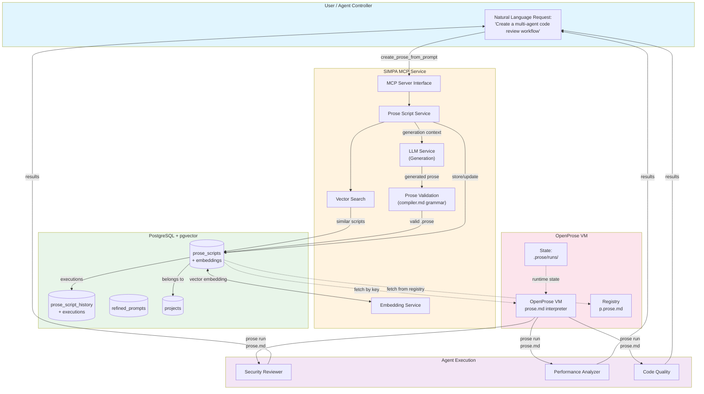
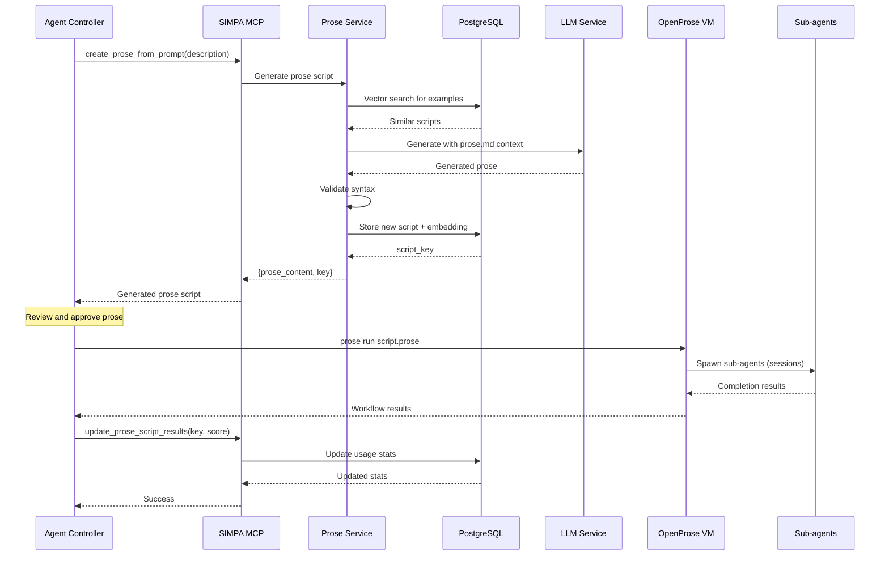

# OpenProse-SIMPA Integration Architecture

**Date**: 2026-03-04  
**Status**: Design Proposal  
**Author**: DT-Developer  
**Version**: 1.0

---

## Executive Summary

This document outlines the architecture for integrating **OpenProse** (a programming language for AI sessions) with **SIMPA** (Self-Improving Meta Prompt Agent). The integration positions SIMPA as a generator and repository for prose scripts, enabling deterministic LLM agent orchestration with semantic search, versioning, and self-improvement capabilities.

### Key Value Proposition

OpenProse provides **deterministic multi-agent orchestration** through `.prose` files, while SIMPA provides **semantic prompt/script discovery** through vector search. Together, they enable:

1. **Natural language to prose script generation** via LLM
2. **Semantic discovery** of existing prose scripts
3. **Versioning and effectiveness tracking** for prose programs
4. **Project-scoped script organization** with cross-project learning

---

## Architecture Overview



---

## Component Breakdown

### 1. MCP Server Interface (Extended)

Five new MCP tools for prose script management:

| Tool | Input | Output | Purpose |
|------|-------|--------|---------|
| `create_prose_from_prompt` | `description`, `agent_type`, `context`, `project_id`¹ | `prose_script` (content), `script_key`, `generation_confidence` | Generate .prose from natural language |
| `list_prose_scripts` | `project_id`² (opt), `agent_type` (opt), `limit`, `offset` | List of script summaries | Browse available scripts |
| `find_prose_scripts` | `query`, `agent_type`, `similarity_threshold`, `max_results` | Matching scripts with scores | Semantic discovery |
| `list_prose_script` | `script_key` or `title` | Full script content + metadata | Retrieve specific script |
| `update_prose_script` | `script_key` (opt), `title`, `prose_content`, `metadata` | `script_key`, `version`, `success` | Store/update script |

> **¹** If SIMPA MCP is started with `--project-id-required` flag, `project_id` becomes **mandatory** for `create_prose_from_prompt` and `update_prose_script`. Otherwise, it's optional.
> **²** When `project_id` is provided to `list_prose_scripts`, results are filtered to that project. When omitted, returns scripts across all projects (if no project_id_required flag).

### 2. Prose Script Service

**Responsibilities:**
- Natural language to `.prose` generation using LLM + prose.md grammar
- Prose script validation against OpenProse compiler rules
- Semantic search using vector + BM25 hybrid approach
- Score tracking and versioning

**Key Algorithms:**

```python
# Generation Flow
def create_prose_from_prompt(description: str, context: dict) -> ProseScript:
    # 1. Embed the description
    embedding = embedding_service.embed(description)
    
    # 2. Find similar existing scripts (for examples)
    similar = repository.find_similar(embedding, limit=3)
    
    # 3. Generate prose using LLM with prose.md as system context
    examples = [s.prose_content for s in similar if s.average_score > 4.0]
    prompt = build_generation_prompt(description, context, examples)
    generated = llm_service.generate(prompt, system_context=PROSE_MD)
    
    # 4. Validate against OpenProse grammar
    validation = prose_validator.validate(generated)
    if not validation.valid:
        raise ValidationError(validation.errors)
    
    # 5. Store with embedding
    return repository.create(
        prose_content=generated,
        embedding=embedding,
        ...
    )
```

### 3. Database Schema Extension

The OpenProse-SIMPA integration requires a single new PostgreSQL table `prose_scripts`, designed to mirror the patterns established in `refined_prompts` for consistency and maintainability.

| Table | Purpose | Key Fields                                                                                                                                         |
|-------|---------|----------------------------------------------------------------------------------------------------------------------------------------------------|
| `prose_scripts` | Stores prose scripts with vector embeddings, refinement lineage, and performance statistics | `id`, `script_key`, `prose_content`, `original_prompt`, `embedding`, `parent_script_id`, `average_score`, `usage_count`, `project_id`              |
| `prose_script_history` | Records each prose script execution with outcomes, scores, and deliverables | `id`, `script_id`, `started_at`, `completed_at`, `execution_score`, `what_worked`, `what_failed`, `end_products`, `files_produced`, `file_updated` |

---

#### Field Descriptions

| Field | Type | Nullable | Description |
|-------|------|----------|-------------|
| `id` | UUID | No | Primary key, internal identifier |
| `script_key` | UUID | No | **Public-facing UUID** for external reference (like `prompt_key` in refined_prompts) |
| `created_at` | TIMESTAMP | No | Record creation timestamp |
| `updated_at` | TIMESTAMP | No | Last modification timestamp |
| `last_used_at` | TIMESTAMP | Yes | Timestamp of last execution |
| `embedding` | VECTOR(768) | Yes | Semantic embedding for similarity search |
| `agent_type` | VARCHAR(100) | No | Classification: type of agent (e.g., "code_reviewer", "test_generator") |
| `refinement_type` | VARCHAR(20) | No | How this script was created: `sigmoid`, `initial`, `manual_edit`, `llm_refinement`, `user_feedback`, `auto_improvement`, `prompted_refine` |
| `main_language` | VARCHAR(50) | Yes | Primary programming language (e.g., "python", "typescript") |
| `other_languages` | JSONB | Yes | Array of secondary languages used |
| `domain` | VARCHAR(100) | Yes | Domain classification (e.g., "web_dev", "data_science") |
| `tags` | JSONB | Yes | Array of searchable tags |
| `original_prompt` | TEXT | No | **The natural language request that generated this prose script** - captures provenance |
| `original_prompt_hash` | VARCHAR(64) | Yes | SHA-256 hash of original_prompt for deduplication |
| `prose_content` | TEXT | No | **The actual .prose script source code** |
| `prose_hash` | VARCHAR(64) | Yes | SHA-256 hash of prose_content for fast-path lookup |
| `refinement_version` | INTEGER | No | Version number in refinement chain (starts at 1) |
| `parent_script_id` | UUID | Yes | **Foreign key to prose_scripts(id)** - the script this was refined from |
| `project_id` | UUID | Yes | **Foreign key to projects(id)** - organizational context |
| `usage_count` | INTEGER | No | Total number of executions |
| `average_score` | DECIMAL(3,2) | No | Average execution score (1.0-5.0) |
| `score_weighted` | DECIMAL | No | Weighted score for ranking algorithms |
| `score_dist_1` | INTEGER | No | Count of 1-star ratings |
| `score_dist_2` | INTEGER | No | Count of 2-star ratings |
| `score_dist_3` | INTEGER | No | Count of 3-star ratings |
| `score_dist_4` | INTEGER | No | Count of 4-star ratings |
| `score_dist_5` | INTEGER | No | Count of 5-star ratings |
| `is_active` | BOOLEAN | No | Soft delete flag (false = archived) |

**Key Design Principles (mirroring `refined_prompts`):**
- **Single-table design**: All prose data in one table (no separate history table)
- **Self-referential FK**: `parent_script_id` → `id` for refinement lineage
- **Public key**: `script_key` for external APIs (like `prompt_key`)
- **Hash-based dedup**: `original_prompt_hash` and `prose_hash` for fast lookups
- **Project scoping**: Optional `project_id` with `--project-id-required` enforcement

---

#### New Table: `prose_scripts`

```sql
-- ============================================
-- prose_scripts table
-- Mirrors refined_prompts structure for consistency
-- ============================================

CREATE TABLE prose_scripts (
    -- Primary identifier (internal)
    id UUID PRIMARY KEY DEFAULT gen_random_uuid(),
    
    -- Public-facing UUID for external reference
    script_key UUID NOT NULL UNIQUE DEFAULT gen_random_uuid(),
    
    -- Timestamps
    created_at TIMESTAMP WITH TIME ZONE NOT NULL DEFAULT NOW(),
    updated_at TIMESTAMP WITH TIME ZONE NOT NULL DEFAULT NOW(),
    last_used_at TIMESTAMP WITH TIME ZONE,
    
    -- Semantic search vector (768-dim for nomic-embed-text)
    embedding VECTOR(768),
    
    -- Classification fields
    agent_type VARCHAR(100) NOT NULL,
    refinement_type VARCHAR(20) NOT NULL DEFAULT 'sigmoid',
    main_language VARCHAR(50),
    other_languages JSONB,
    domain VARCHAR(100),
    tags JSONB,
    
    -- Content fields
    title VARCHAR(255),
    description TEXT,
    original_prompt TEXT NOT NULL,  -- Natural language request that generated this prose
    original_prompt_hash VARCHAR(64),  -- SHA-256 for deduplication
    prose_content TEXT NOT NULL,  -- The actual .prose script source
    prose_hash VARCHAR(64) UNIQUE,  -- SHA-256 for fast-path lookup
    
    -- Refinement chain (self-referential, like prior_refinement_id)
    refinement_version INTEGER NOT NULL DEFAULT 1,
    parent_script_id UUID REFERENCES prose_scripts(id) ON DELETE SET NULL,
    
    -- Project context (optional, matches refined_prompts pattern)
    project_id UUID REFERENCES projects(id) ON DELETE SET NULL,
    
    -- Performance statistics (identical to refined_prompts)
    usage_count INTEGER NOT NULL DEFAULT 0,
    average_score DECIMAL(3,2) NOT NULL DEFAULT 0.0,
    score_weighted DECIMAL NOT NULL DEFAULT 0.0,
    score_dist_1 INTEGER NOT NULL DEFAULT 0,
    score_dist_2 INTEGER NOT NULL DEFAULT 0,
    score_dist_3 INTEGER NOT NULL DEFAULT 0,
    score_dist_4 INTEGER NOT NULL DEFAULT 0,
    score_dist_5 INTEGER NOT NULL DEFAULT 0,
    
    -- Soft delete for audit trail
    is_active BOOLEAN NOT NULL DEFAULT TRUE
);

-- ============================================
-- Indexes (matching refined_prompts patterns)
-- ============================================

-- Primary and unique constraint indexes (handled by PG automatically)
-- id: PRIMARY KEY
-- script_key: UNIQUE

-- Vector similarity search
CREATE INDEX idx_prose_scripts_embedding 
    ON prose_scripts USING ivfflat (embedding vector_cosine_ops) 
    WITH (lists = 100);

-- Classification indexes
CREATE INDEX idx_prose_scripts_agent_type 
    ON prose_scripts(agent_type) 
    WHERE is_active = TRUE;

CREATE INDEX idx_prose_scripts_main_language 
    ON prose_scripts(main_language) 
    WHERE main_language IS NOT NULL AND is_active = TRUE;

CREATE INDEX idx_prose_scripts_domain 
    ON prose_scripts(domain) 
    WHERE domain IS NOT NULL AND is_active = TRUE;

-- Refinement chain index (self-referential FK)
CREATE INDEX idx_prose_scripts_parent 
    ON prose_scripts(parent_script_id) 
    WHERE parent_script_id IS NOT NULL;

-- Project scoping
CREATE INDEX idx_prose_scripts_project 
    ON prose_scripts(project_id) 
    WHERE project_id IS NOT NULL;

-- Hash-based fast path lookups
CREATE INDEX idx_prose_scripts_original_hash 
    ON prose_scripts(original_prompt_hash) 
    WHERE original_prompt_hash IS NOT NULL;

-- Full-text search (BM25)
CREATE INDEX idx_prose_scripts_content_search 
    ON prose_scripts 
    USING gin(to_tsvector('english', 
        COALESCE(prose_content, '') || ' ' || 
        COALESCE(description, '') || ' ' ||
        COALESCE(original_prompt, '')
    ));

-- Score-based queries for optimization
CREATE INDEX idx_prose_scripts_score 
    ON prose_scripts(average_score DESC, usage_count DESC)
    WHERE is_active = TRUE;

-- Timestamp queries
CREATE INDEX idx_prose_scripts_last_used 
    ON prose_scripts(last_used_at DESC NULLS LAST)
    WHERE is_active = TRUE;

-- ============================================
-- Updated-at trigger (automatic updated_at maintenance)
-- ============================================

CREATE OR REPLACE FUNCTION update_prose_scripts_updated_at()
RETURNS TRIGGER AS $$
BEGIN
    NEW.updated_at = NOW();
    RETURN NEW;
END;
$$ LANGUAGE plpgsql;

CREATE TRIGGER trigger_prose_scripts_updated_at
    BEFORE UPDATE ON prose_scripts
    FOR EACH ROW
    EXECUTE FUNCTION update_prose_scripts_updated_at();

-- ============================================
-- prose_script_history table
-- Tracks each execution of a prose script with outcomes
-- ============================================

CREATE TABLE prose_script_history (
    -- Primary identifier
    id UUID PRIMARY KEY DEFAULT gen_random_uuid(),
    
    -- Foreign key to the executed script
    script_id UUID NOT NULL REFERENCES prose_scripts(id) ON DELETE CASCADE,
    
    -- Execution context
    executed_by_agent VARCHAR(100),  -- Which agent ran this (e.g., "OpenProse-VM", "user")
    session_id UUID,  -- Optional: links to user session
    git_commit_hash VARCHAR(40),  -- If executed in a git repo context
    
    -- Timestamps
    started_at TIMESTAMP WITH TIME ZONE NOT NULL DEFAULT NOW(),
    completed_at TIMESTAMP WITH TIME ZONE,  -- NULL if still running or failed
    execution_duration_ms INTEGER,  -- Auto-computed from started/completed
    
    -- Score for this specific run (1-5, given by controlling agent)
    execution_score DECIMAL(3,2),  -- NULL if not yet scored
    
    -- What worked (successes, positive outcomes)
    what_worked TEXT,  -- Freeform description of successful actions
    files_produced JSONB,  -- Array of files created
    file_updated JSONB,  -- modified successfully
    artifacts_generated JSONB,  -- Other outputs (reports, data, etc.)
    
    -- What did not work (failures, issues encountered)
    what_failed TEXT,  -- Freeform description of failures
    errors_encountered JSONB,  -- Structured error information
    agents_that_failed JSONB,  -- Which agents in the script had issues

    -- Files modified (for git-based workflows)
    files_modified TEXT[],
    files_added TEXT[],
    files_deleted TEXT[],
    diffs JSONB,  -- Structured diff information
    
    -- End products (final deliverables/outputs)
    end_products JSONB,  -- Array of artifacts/deliverables produced
    summary TEXT,  -- Overall execution summary
    validation_results JSONB,  -- Structured validation outcomes (pass/fail per check)
    
    -- Execution metadata
    command_line TEXT,  -- If executed via CLI, the command used
    environment TEXT,  -- Environment info (docker, local, etc.)
    input_parameters JSONB,  -- Any runtime parameters passed to the script
    
    -- Soft delete for audit trail
    is_active BOOLEAN NOT NULL DEFAULT TRUE
);

-- ============================================
-- prose_script_history indexes
-- ============================================

-- Look up history by script
CREATE INDEX idx_prose_history_script_id 
    ON prose_script_history(script_id)
    WHERE is_active = TRUE;

-- Look up recent executions
CREATE INDEX idx_prose_history_started_at 
    ON prose_script_history(started_at DESC)
    WHERE is_active = TRUE;

-- Look up completed executions
CREATE INDEX idx_prose_history_completed_at 
    ON prose_script_history(completed_at DESC NULLS FIRST)
    WHERE completed_at IS NOT NULL AND is_active = TRUE;

-- Find unscored executions (for batch scoring review)
CREATE INDEX idx_prose_history_unscored 
    ON prose_script_history(script_id, started_at)
    WHERE execution_score IS NULL AND completed_at IS NOT NULL;

-- Score-based queries for analysis
CREATE INDEX idx_prose_history_score 
    ON prose_script_history(script_id, execution_score)
    WHERE execution_score IS NOT NULL;

-- Failed executions for debugging
CREATE INDEX idx_prose_history_failures 
    ON prose_script_history(script_id, started_at)
    WHERE what_failed IS NOT NULL AND is_active = TRUE;
```

### 4. Vector + BM25 Hybrid Search

```sql
-- Hybrid search: combine vector similarity with BM25 text search
CREATE OR REPLACE FUNCTION find_prose_scripts(
    query_embedding VECTOR(768),
    query_text TEXT,
    target_agent_type VARCHAR(100),
    match_threshold FLOAT DEFAULT 0.7,
    max_results INTEGER DEFAULT 5
)
RETURNS TABLE(
    script_id UUID,
    script_key UUID,
    title VARCHAR(255),
    similarity FLOAT,
    text_rank FLOAT,
    combined_score FLOAT,
    average_score DECIMAL(3,2),
    usage_count INTEGER
) AS $$
BEGIN
    RETURN QUERY
    WITH vector_results AS (
        SELECT 
            ps.id,
            ps.script_key,
            ps.title,
            ps.average_score,
            ps.usage_count,
            1 - (ps.embedding <=> query_embedding) as vector_sim
        FROM prose_scripts ps
        WHERE ps.agent_type = target_agent_type
            AND ps.is_active = TRUE
            AND 1 - (ps.embedding <=> query_embedding) > match_threshold
    ),
    text_results AS (
        SELECT 
            ps.id,
            ts_rank(
                to_tsvector('english', ps.prose_content || ' ' || COALESCE(ps.description, '')),
                plainto_tsquery('english', query_text)
            ) as text_rank
        FROM prose_scripts ps
        WHERE ps.agent_type = target_agent_type
            AND ps.is_active = TRUE
    )
    SELECT 
        vr.id as script_id,
        vr.script_key,
        vr.title,
        vr.vector_sim as similarity,
        COALESCE(tr.text_rank, 0) as text_rank,
        (vr.vector_sim * 0.6 + COALESCE(tr.text_rank, 0) * 0.4) as combined_score,
        vr.average_score,
        vr.usage_count
    FROM vector_results vr
    LEFT JOIN text_results tr ON vr.id = tr.id
    ORDER BY combined_score DESC, vr.average_score DESC
    LIMIT max_results;
END;
$$ LANGUAGE plpgsql;
```

---

## Code Structure

```
src/simpa/
├── prose/
│   ├── __init__.py
│   ├── models.py              # ProseScript, ProseScriptHistory SQLAlchemy models
│   ├── repository.py          # ProseScriptRepository (CRUD + vector search)
│   ├── service.py             # ProseScriptService (generation + validation)
│   ├── validation.py          # Prose syntax validation (regex based)
│   └── compiler_context.py    # prose.md content as system context
├── mcp_server.py              # Extended with 5 prose tools
├── db/
│   └── models.py              # Added prose script tables
└── ... (existing structure)
```

---

## OpenAPI Specification (MCP Tools)

### Tool: `create_prose_from_prompt`

```yaml
openapi: 3.0.0
info:
  title: Create Prose Script from Prompt
  version: 1.0.0
paths:
  /tools/create_prose_from_prompt:
    post:
      description: Generate a .prose script from natural language description
      requestBody:
        content:
          application/json:
            schema:
              type: object
              required: [description, agent_type]
              properties:
                description:
                  type: string
                  description: Natural language description of desired workflow
                  example: "Create a 3-agent code review: security, performance, style"
                agent_type:
                  type: string
                  example: "DT-Developer"
                context:
                  type: object
                  properties:
                    main_language:
                      type: string
                      example: "python"
                    complexity:
                      type: string
                      enum: [simple, moderate, complex]
                project_id:
                  type: string
                  format: uuid
                  description: Optional project association
      responses:
        200:
          description: Generated prose script
          content:
            application/json:
              schema:
                type: object
                properties:
                  prose_content:
                    type: string
                    description: Valid .prose file content
                  script_key:
                    type: string
                    format: uuid
                  generation_confidence:
                    type: number
                    minimum: 0
                    maximum: 1
                  similar_scripts_found:
                    type: integer
```

### Tool: `find_prose_scripts`

```yaml
openapi: 3.0.0
info:
  title: Find Prose Scripts (Vector + BM25)
  version: 1.0.0
paths:
  /tools/find_prose_scripts:
    post:
      description: Search prose scripts using semantic + text search
      requestBody:
        content:
          application/json:
            schema:
              type: object
              required: [query]
              properties:
                query:
                  type: string
                  description: Search query (natural language)
                  example: "parallel code review workflow"
                agent_type:
                  type: string
                similarity_threshold:
                  type: number
                  default: 0.7
                  minimum: 0
                  maximum: 1
                max_results:
                  type: integer
                  default: 5
                  maximum: 20
      responses:
        200:
          description: Matching scripts
          content:
            application/json:
              schema:
                type: object
                properties:
                  scripts:
                    type: array
                    items:
                      type: object
                      properties:
                        script_key:
                          type: string
                        title:
                          type: string
                        similarity:
                          type: number
                        average_score:
                          type: number
                        preview:
                          type: string
```

---

## Integration Flow



---

## Validation Strategy

### 1. Syntax Validation (Pre-storage)

Uses OpenProse grammar from `compiler.md`:

```python
class ProseValidator:
    PATTERNS = {
        'agent_def': r'^agent\s+\w+:\s*$',
        'session': r'^session\s*(?::\s*\w+)?\s*$',
        'block_def': r'^block\s+\w+\([^)]*\):',
        'parallel': r'^parallel\s*:',
        'resume': r'^resume\s*:\s*\w+',
        'property': r'^\s+(model:|prompt:|persist:|context:|retry:)'
    }
    
    def validate(self, prose_content: str) -> ValidationResult:
        errors = []
        
        # Check for required sections
        if not re.search(r'(session|resume)', prose_content):
            errors.append("At least one session or resume statement required")
        
        # Validate agent references
        agents_defined = re.findall(r'^agent\s+(\w+):', prose_content, re.MULTILINE)
        agents_used = re.findall(r'session\s*:\s*(\w+)', prose_content)
        for agent in agents_used:
            if agent not in agents_defined:
                errors.append(f"Undefined agent: {agent}")
        
        # Indentation consistency check
        lines = prose_content.split('\n')
        indents = [len(line) - len(line.lstrip()) for line in lines if line.strip()]
        if indents and min(indents) > 0:
            errors.append("Inconsistent indentation: first non-empty line must have 0 indent")
        
        return ValidationResult(valid=len(errors) == 0, errors=errors)
```

### 2. Semantic Validation (Post-generation)

- LLM verification that generated prose matches original intent
- Simulation-based testing (dry-run through prose.md VM)
- Score-based validation (only store if confidence > 0.7)

---

## Prose Script Refinement Hierarchy

Prose scripts support **versioned refinement** - creating improved variants while maintaining lineage. This enables:

1. **A/B Testing**: Compare different versions of the same workflow
2. **Rollback**: Revert to previous working versions
3. **Lineage Tracking**: Understand how scripts evolved
4. **Collaborative Editing**: Track who refined what and why

### Refinement Types

| Type | Description | When Used |
|------|-------------|-----------|
| `manual_edit` | Human directly edited prose content | Developer improves script by hand |
| `llm_refinement` | AI suggested improvements based on prompt | "Refine this script for better error handling" |
| `user_feedback` | Changes based on execution feedback | Score was low, user provided suggestions |
| `auto_improvement` | System automatically improved based on metrics | Self-improvement loop detected patterns |

### Lineage Example

```
Root Script (v1, depth=0)
├── Refinement A (v2, depth=1, type=llm_refinement)
│   └── Refinement A1 (v3, depth=2, type=manual_edit)
└── Refinement B (v2, depth=1, type=user_feedback)
    └── Refinement B1 (v3, depth=2, type=llm_refinement)
        └── Refinement B2 (v4, depth=3, type=manual_edit)
```

### Querying Lineage

**Get Full Lineage (Root to Current):**
```sql
-- Walk backwards from current to root using parent_script_id chain
WITH RECURSIVE lineage AS (
    -- Start from current script
    SELECT 
        id, 
        script_key, 
        title, 
        refinement_version,
        parent_script_id, 
        prose_content,
        refinement_reason, 
        refinement_type,
        0 as depth  -- Distance from current (0 = current)
    FROM prose_scripts
    WHERE id = 'current-script-uuid'
    
    UNION ALL
    
    -- Walk backwards to root
    SELECT 
        ps.id, 
        ps.script_key, 
        ps.title, 
        ps.refinement_version,
        ps.parent_script_id,
        ps.prose_content,
        ps.refinement_reason, 
        ps.refinement_type,
        l.depth + 1
    FROM prose_scripts ps
    JOIN lineage l ON ps.id = l.parent_script_id
)
SELECT * FROM lineage ORDER BY depth DESC;  -- Root first, current last
```

**Get All Descendants of a Script:**
```sql
-- Walk forwards from root to all children
WITH RECURSIVE descendants AS (
    -- Start from root script
    SELECT 
        id, 
        script_key, 
        title, 
        refinement_version,
        parent_script_id,
        prose_content,
        refinement_type,
        0 as depth
    FROM prose_scripts
    WHERE id = 'root-script-uuid'
    
    UNION ALL
    
    -- Walk forwards to children
    SELECT 
        ps.id, 
        ps.script_key, 
        ps.title, 
        ps.refinement_version,
        ps.parent_script_id,
        ps.prose_content,
        ps.refinement_type,
        d.depth + 1
    FROM prose_scripts ps
    JOIN descendants d ON ps.parent_script_id = d.id
)
SELECT * FROM descendants ORDER BY depth, refinement_version;
```

**Get Siblings (Scripts with Same Parent):**
```sql
SELECT 
    ps.id,
    ps.script_key,
    ps.title,
    ps.refinement_version,
    ps.parent_script_id,
    ps.average_score
FROM prose_scripts ps
WHERE ps.parent_script_id = (
    SELECT parent_script_id 
    FROM prose_scripts 
    WHERE id = 'current-script-uuid'
)
AND ps.id != 'current-script-uuid'
ORDER BY ps.refinement_version;
```

### MCP Tool: Update with Refinement

When calling `update_prose_script` with a `parent_script_id`, the system automatically:
1. Sets `refinement_version = parent.refinement_version + 1`
2. Records `parent_script_id` in the new record
3. Records `refinement_type` and optional `refinement_reason`

**Example Request:**
```json
{
  "parent_script_id": "uuid-of-previous-version",
  "title": "Enhanced Code Review",
  "prose_content": "# Updated prose...",
  "refinement_type": "llm_refinement",
  "refinement_reason": "Added security scanning agent based on user feedback"
}
```

**Note**: Root lineage is computed dynamically by walking the `parent_script_id` chain. No static `root_script_id` field is stored.

---

## Prompted Prose Refinement

In addition to direct parent-child refinement, SIMPA supports **prompted prose refinement** - a hybrid workflow that combines semantic retrieval with iterative improvement.

### Workflow: Prompt → Search → Refine

**When `create_prose_from_prompt` is called with semantic similarity:**

```
1. User provides natural language description
2. SIMPA embeds the query and searches prose_scripts
3. If a suitable existing script is found (similarity > threshold):
   - Retrieve the existing prose script
   - Use it as context for LLM refinement
   - Generate refined prose based on the prompt's specific requirements
4. If no suitable script exists:
   - Generate new prose from scratch (standard flow)
5. The resulting script maintains lineage to the source script
```

### Similarity Threshold for Refinement

| Similarity Score | Action | Rationale |
|-----------------|--------|-----------|
| ≥ 0.90 | **Return existing** | Exact match, no generation needed |
| 0.75 - 0.89 | **Refine existing** | Similar intent, customize for specifics |
| 0.60 - 0.74 | **Blend multiple** | Combine best parts from similar scripts |
| < 0.60 | **Generate from scratch** | Too dissimilar, create new script |

### Refinement Request Example

**User Prompt:** "Create a code review script focused on Python async patterns and FastAPI best practices"

**Search Results:**
- Found: "General Python Code Review" (similarity: 0.82)
- Found: "FastAPI Security Review" (similarity: 0.78)

**Refinement Prompt to LLM:**
```
Base on this existing prose script:
---
[Content of "General Python Code Review" script]
---

Refine it to meet this request:
"Create a code review script focused on Python async patterns and FastAPI best practices"

Requirements:
- Emphasize async/await patterns
- Check for FastAPI dependency injection issues
- Validate proper exception handling in async contexts
- Include performance checks for async operations

Refinement type: prompted_refine
Parent script: [uuid-of-general-python-review]
```

### Storage Structure

Prompted refinements are stored with:
- `parent_script_id`: UUID of the script that was refined
- `refinement_type`: `prompted_refine` (distinct from `llm_refinement`)
- `refinement_reason`: The specific prompted modification
- `original_prompt`: The natural language request that triggered the refinement
- Root lineage preserved for scoring aggregation

---

## Prose Script Scoring & Sigmoid-Based Refinement Decision

Prose scripts use **simple 1-5 star scoring** for execution quality, with a **sigmoid-based algorithm** to determine whether to refine an existing script or create a new one for a given request.

### Execution Scoring Model

After a prose script executes, the controlling agent rates the execution:

| Score | Meaning | When to Assign |
|-------|---------|----------------|
| 1 | Poor | Script failed, produced incorrect results, or had syntax errors |
| 2 | Below Average | Script ran but results were incomplete or partially incorrect |
| 3 | Average | Script worked but could be improved |
| 4 | Good | Script executed well, met expectations |
| 5 | Excellent | Script exceeded expectations, highly effective |

These scores are stored in the database:

```python
# Score distribution tracking (simple counts)
score_dist_1: int  # Count of 1-star ratings
score_dist_2: int  # Count of 2-star ratings  
score_dist_3: int  # Count of 3-star ratings
score_dist_4: int  # Count of 4-star ratings
score_dist_5: int  # Count of 5-star ratings

average_score: DECIMAL(3,2)  # Weighted average: sum(score * count) / total
usage_count: int  # Total executions (sum of all dist_*)
```

### Sigmoid-Based Refinement Decision

**Purpose**: When `create_prose_from_prompt` finds an existing similar script, use sigmoid logic to decide whether to:
1. **Return the existing script** (reuse), OR
2. **Refine the existing script** into a new variant

**NOT for**: Scoring itself - scores are simple 1-5 averages.

```python
import math

def should_refine_or_reuse(
    average_score: float, 
    usage_count: int,
    request_similarity: float  # How similar is the new request to the existing script
) -> dict:
    """
    Decide whether to refine an existing prose script or use it as-is.
    
    This is the same sigmoid logic used by SIMPA for prompt refinement decisions.
    High-scoring, well-used scripts are "trusted" and returned as-is.
    Low-scoring or low-usage scripts trigger refinement.
    """
    
    # Normalize average_score from [1,5] to [0,1] range
    normalized_score = (average_score - 1) / 4  # 1→0.0, 3→0.5, 5→1.0
    
    # Sigmoid parameters (tunable)
    k = 8  # Steepness of curve
    x0 = 0.6  # Decision midpoint (3.4 / 5.0 = "above average")
    
    # Base sigmoid: probability of "reuse as-is" vs "refine"
    reuse_probability = 1 / (1 + math.exp(-k * (normalized_score - x0)))
    
    # Confidence factor: more usage = more trustworthy score
    confidence = min(usage_count / 5, 1.0)  # Full confidence at 5+ uses
    
    # Adjust for usage uncertainty
    effective_reuse = reuse_probability * confidence + 0.3 * (1 - confidence)
    
    # Also consider request similarity - even good scripts get refined if request differs significantly
    similarity_threshold = 0.85
    if request_similarity < similarity_threshold:
        # Request is different enough to warrant refinement
        effective_reuse *= request_similarity  # Reduce reuse probability
    
    return {
        "action": "reuse" if effective_reuse > 0.5 else "refine",
        "reuse_probability": round(effective_reuse, 3),
        "confidence": round(confidence, 3),
        "similarity": round(request_similarity, 3),
        "rationale": "High score and usage" if effective_reuse > 0.5 else "Low score or insufficient data"
    }

# Decision examples:
# - Score 4.5, usage 10, similar 0.92 → reuse (probability: 0.94)
# - Score 2.8, usage 3, similar 0.75 → refine (probability: 0.12)
# - Score 3.5, usage 2, similar 0.90 → refine (low confidence: 0.40)
```

### Decision Visualization

```
Reuse Probability (don't refine)
     1.0 |      ___________
         |     /
     0.8 |    /
         |   /
     0.6 |  /---- Decision threshold (0.5)
         | /
     0.4 |/
         |
     0.2 |
         |
     0.0 +------------------
         1.0  2.0  3.0  4.0  5.0
                    ↑
              Average Score
                 (x0 ≈ 3.4)
```

Scripts with average score > 3.4 and sufficient usage are likely reused. Scripts below this threshold or with low confidence trigger refinement.

### Complete Decision Flow

**When `create_prose_from_prompt` is called:**

```
1. Embed the user request
2. Search prose_scripts for similar scripts
3. For each candidate script above similarity threshold (0.75):
   a. Calculate sigmoid reuse_probability
   b. If reuse_probability > 0.5:
      → Return existing script with metadata
   c. If reuse_probability ≤ 0.5:
      → Queue for refinement
4. If no suitable script found:
   → Generate new prose from scratch
5. If one or more scripts queued for refinement:
   → Pick best candidate (highest score × similarity)
   → Generate refined prose based on parent + new requirements
   → Store with parent_script_id link
```

### Comparison: Simple Scoring vs Sigmoid Decision

| Aspect | Scoring | Sigmoid Decision |
|--------|---------|------------------|
| **Purpose** | Rate execution quality | Decide refine vs reuse |
| **Mechanism** | Simple 1-5 average | Sigmoid curve on score |
| **Output** | `average_score` decimal | "reuse" or "refine" action |
| **Factors** | Raw user/agent ratings | Score + usage + similarity |
| **Tuning** | None (direct feedback) | `k`, `x0`, `confidence_threshold` |

### Update Triggers

The sigmoid decision is recalculated during `create_prose_from_prompt`, but also check these conditions:

| Condition | Effect on Decision |
|-----------|-------------------|
| `usage_count < 2` | Low confidence, always favor refinement |
| `average_score < 2.5` | Poor performance, strongly favor refinement |
| `request_similarity < 0.80` | Different intent, reduce reuse probability |
| `average_score > 4.0 AND usage > 5` | Strong candidate, likely reuse |
| Score declining (last 3 < avg) | Trending down, trigger refinement review |

### Integration with SIMPA Dashboard

Future analytics visualization:
- **Script Health Score**: Sigmoid-based 0-100 score
- **Refinement Recommendations**: Scripts flagged for optimization
- **Lineage View**: Score trends across versions
- **A/B Test Results**: Comparison of refinement branches

---

## Project ID Requirements

The SIMPA MCP server can be started with the `--project-id-required` flag to enforce project association for all prose script operations.

### When `--project-id-required` is set:

| Tool | Behavior |
|------|----------|
| `create_prose_from_prompt` | `project_id` becomes **mandatory**. Returns error with available projects if omitted. |
| `update_prose_script` | `project_id` becomes **mandatory** for new scripts. |
| `list_prose_scripts` | Returns scripts filtered to the specified project only. |

**Error Response Example** (when project_id required but not provided):
```json
{
  "error": "project_id_required",
  "message": "A project_id is required. Please provide a valid project_id.",
  "available_projects": [
    {"project_id": "uuid", "project_name": "My Project", "main_language": "python"}
  ]
}
```

### When `--project-id-required` is NOT set:

| Tool | Behavior |
|------|----------|
| `create_prose_from_prompt` | `project_id` is optional. Script will be stored with `NULL` project_id. |
| `update_prose_script` | `project_id` is optional for new scripts. |
| `list_prose_scripts` | Returns all scripts (project_id filter is optional). |

This flag is configured via `settings.require_project_id` in `config.py`.

---

## Security Considerations

| Layer | Implementation |
|-------|----------------|
| Input Sanitization | PII detection before LLM generation |
| Script Validation | Syntax validation prevents injection |
| Access Control | Project-based scoping for script visibility |
| Review Required | Generated scripts need approval before use |
| Audit Trail | All creations/updates logged to history |

---

## Performance Considerations

### Caching Strategy

```python
# Multi-tier caching (reuses SIMPA's existing pattern)
CACHE_LAYERS = {
    "hash_fast_path": {
        "key": "SHA256(prose_content)",
        "hit_rate_target": 40,
        "use_case": "Exact prose script match"
    },
    "llm_generation_cache": {
        "key": "SHA256(description + context_hash)",
        "ttl": "1 hour",
        "use_case": "Avoid duplicate generations"
    },
    "embedding_cache": {
        "type": "LRU in-memory",
        "use_case": "Avoid re-embedding identical queries"
    }
}
```

### Scaling Targets

| Metric | Target |
|--------|--------|
| Generation Latency | < 3s (95th percentile) |
| Search Latency | < 200ms (p95) |
| Concurrent Generations | 10/minute |
| Script Storage | Support 100K+ scripts |
| Vector Index Size | Manageable with ivfflat |

---

## Migration Strategy

### Database Migration

```python
# Alembic migration
revision = '008_add_prose_scripts'
down_revision = '007_add_refined_prompt_hash_index'

def upgrade():
    # Create prose_scripts table (single table design, matching refined_prompts pattern)
    op.create_table('prose_scripts', ...)
    
    # Create prose_script_history table (execution tracking)
    op.create_table('prose_script_history', ...)
    
    # Create indexes for prose_scripts
    op.create_index('idx_prose_scripts_embedding', ...)
    op.create_index('idx_prose_scripts_content_search', ...)
    
    # Create indexes for prose_script_history
    op.create_index('idx_prose_history_script_id', ...)
    op.create_index('idx_prose_history_started_at', ...)
    
    # Create updated_at trigger for prose_scripts
    op.execute('''
        CREATE TRIGGER trigger_prose_scripts_updated_at
        BEFORE UPDATE ON prose_scripts
        FOR EACH ROW
        EXECUTE FUNCTION update_prose_scripts_updated_at();
    ''')

def downgrade():
    # Drop in reverse order (history first due to FK constraint)
    op.drop_table('prose_script_history')
    op.drop_table('prose_scripts')
```

### Feature Rollout

1. **Phase 1**: Basic CRUD (`list_prose_script`, `update_prose_script`)
2. **Phase 2**: Semantic search (`find_prose_scripts`)
3. **Phase 3**: Generation (`create_prose_from_prompt` with validation)
4. **Phase 4**: Full integration with OpenProse VM execution tracking

---

## Thoughts on Integration

### Why This Integration Makes Sense

1. **Complementary Strengths**:
   - OpenProse: Deterministic agent orchestration, persistent state, multi-agent workflows
   - SIMPA: Semantic search, self-improvement through scoring, project organization

2. **Natural Evolution of Prompts**:
   - Prose scripts are essentially "compound prompts" - workflows, not single instructions
   - SIMPA already manages prompts; extending to workflows is logical

3. **Reuse of Existing Infrastructure**:
   - Vector search (pgvector)
   - LLM service (OpenAI/Anthropic/Ollama)
   - Project scoping and organization
   - Score tracking and self-improvement

4. **Quality Assurance**:
   - OpenProse's grammar validation ensures generated scripts are syntactically valid
   - SIMPA's score tracking enables continuous improvement of generation quality
   - Hybrid search ensures discovery of relevant scripts

### Potential Challenges & Mitigations

| Challenge | Mitigation |
|-----------|------------|
| LLM-generated prose may be semantically incorrect | Require human review, track execution scores |
| Vector search on code requires special handling | Use code-aware embeddings, include AST tokens |
| Prose script versioning complexity | Track parent-child relationships, semantic versioning |
| Cross-project script sharing | Leverage existing Project model, add visibility settings |

---

## Next Steps

1. **Database**: Create migration for prose_scripts tables
2. **Models**: Add ProseScript, ProseScriptHistory SQLAlchemy models
3. **Repository**: Implement ProseScriptRepository with vector search
4. **Service**: Build ProseScriptService with generation + validation
5. **MCP Tools**: Add 5 new tools to mcp_server.py
6. **Testing**: Unit tests for validation, integration tests for generation
7. **Documentation**: Update API docs, add usage examples

---

## Appendix: Example Generated Prose Script

**Input Description**: "Create a multi-agent code review pipeline with security, performance, and style checks"

**Generated Output**:

```prose
# Multi-Agent Code Review Pipeline
# Generated from: "Create a multi-agent code review..."

agent security-reviewer:
  model: opus
  prompt: "You are a security expert. Identify OWASP Top 10 vulnerabilities, injection risks, and authentication issues. Be thorough and specific."

agent performance-reviewer:
  model: sonnet
  prompt: "You are a performance optimization specialist. Look for N+1 queries, unnecessary allocations, blocking operations, and algorithmic inefficiencies."

agent style-reviewer:
  model: haiku
  prompt: "You check code style, naming conventions, documentation, and PEP8 compliance. Focus on readability and maintainability."

# Run reviews in parallel
parallel:
  security_findings = session: security-reviewer
    prompt: "Review for security vulnerabilities"
  
  performance_findings = session: performance-reviewer
    prompt: "Review for performance issues"
  
  style_findings = session: style-reviewer
    prompt: "Review for style and best practices"

# Consolidate all findings
session: security-reviewer
  model: opus
  prompt: "Create a consolidated review report from all findings"
  context: { security_findings, performance_findings, style_findings }
```

---

*This architecture document was generated using the DyTopo multi-agent process with integration analysis from DT-Developer.*
