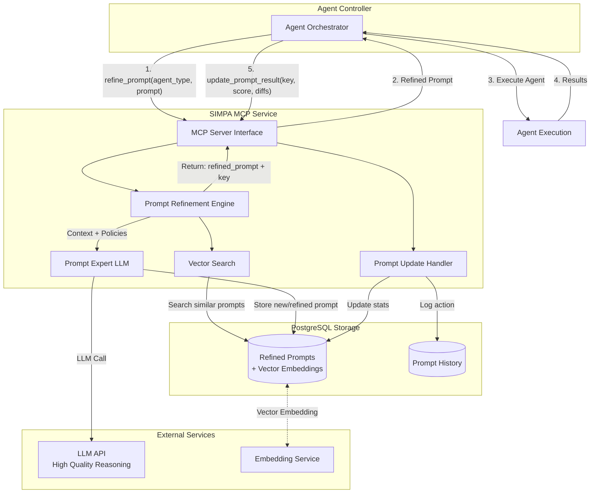
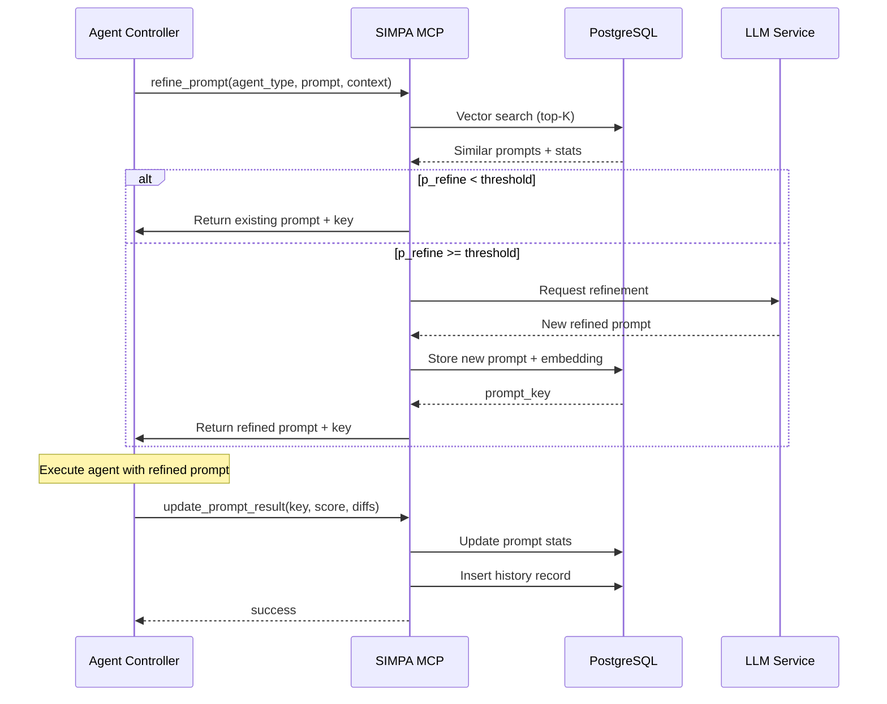

# SIMPA Architecture Design

**Date**: 2026-03-03  
**Architect**: DT-Architect  
**Version**: 1.0

## Overview

SIMPA (Self-Improving Meta Prompt Agent) is an MCP service that refines agent prompts before execution, learning from outcomes to continuously optimize prompt quality.

## High-Level Architecture



## Component Breakdown

### 1. MCP Server Interface
Presents SIMPA as an MCP service with two primary tools:

| Tool | Input | Output |
|------|-------|--------|
| `simpa_refine_prompt` | `agent_type`, `original_prompt`, `context` | `refined_prompt`, `prompt_key`, `source` (new/existing) |
| `simpa_update_result` | `prompt_key`, `action_score`, `files_modified`, `diffs` | `success` |

### 2. Prompt Refinement Engine
- **Vector Search**: Embeds query (agent_type + original_prompt) and finds top-K similar successful prompts
- **Refinement Decision**: Uses sigmoid-based probability:
  ```
  p_refine(S) = 1 / (1 + exp(k * (S - μ)))
  ```
  - Default μ = 3.0 (50% threshold at average score)
  - Default k = 1.5 (balanced steepness)
- **Policy Context**: Injects Security, Coding, Testing, and Linting policies into refinement context

### 3. Prompt Expert (LLM)
- Receives: Original prompt + Top-K similar successful prompts + Policy context
- Decides: Reuse existing or refine
- Outputs: Final prompt string with applicable examples and comments

### 4. Vector + Relational Storage
PostgreSQL with pgvector extension handles both vector and relational data.

**Table: `refined_prompts`**
```sql
CREATE TABLE refined_prompts (
    id SERIAL PRIMARY KEY,
    prompt_key UUID UNIQUE NOT NULL,
    embedding VECTOR(768),  -- nomic-embed-text
    main_language VARCHAR(50),
    other_languages TEXT[],
    original_prompt TEXT NOT NULL,
    refined_prompt TEXT NOT NULL,
    prior_refinement_id INTEGER REFERENCES refined_prompts(id),
    usage_count INTEGER DEFAULT 0,
    average_score DECIMAL(3,2) DEFAULT 0.0,
    score_dist_1 INTEGER DEFAULT 0,
    score_dist_2 INTEGER DEFAULT 0,
    score_dist_3 INTEGER DEFAULT 0,
    score_dist_4 INTEGER DEFAULT 0,
    score_dist_5 INTEGER DEFAULT 0,
    created_at TIMESTAMP DEFAULT NOW(),
    updated_at TIMESTAMP DEFAULT NOW()
);
```

**Table: `prompt_history`**
```sql
CREATE TABLE prompt_history (
    id SERIAL PRIMARY KEY,
    prompt_id INTEGER REFERENCES refined_prompts(id),
    action_score DECIMAL(3,2) NOT NULL,
    files_modified TEXT[],
    diffs JSONB,  -- {language: [{file, diff}, ...]}
    created_at TIMESTAMP DEFAULT NOW()
);
```

## Self-Improvement Mechanism

### Refinement Intensity Curve

| Score | Refinement Probability | Behavior |
|-------|------------------------|----------|
| 1.0   | 95.3%                  | Aggressive refinement |
| 2.0   | 81.8%                  | High chance to improve |
| 3.0   | 50.0%                  | Coin-flip territory |
| 4.0   | 18.2%                  | Usually reuse |
| 5.0   | 4.7%                   | Rarely refine (preserves diversity) |

### Score Distribution Tracking
- Maintains histogram bins (1-5) for score distribution
- Enables data-driven refinement decisions
- Supports evolution of the sigmoid parameters (μ, k) over time

### Feedback Loop
1. Lower-scoring prompts → Higher refinement probability
2. Score updates aggregated into running average
3. Distribution tracking informs system-wide improvements

## MCP Integration Flow



## Technology Stack Recommendations

| Component | Recommendation | Rationale |
|-----------|---------------|-----------|
| MCP Framework | FastMCP (Python) | Native Python, async support, easy integration |
| Database | PostgreSQL 15+ with pgvector | Single source of truth, proven vector capabilities |
| Embedding Model | nomic-embed-text:latest | Local via Ollama, 768-dim, good balance |
| LLM | Claude 3.5 Sonnet or GPT-4 | High-quality reasoning for refinement |
| ORM | SQLAlchemy 2.0 | Mature, async support, type hints |

## Deployment Considerations

### Production Environment
- PostgreSQL with pgvector extension enabled
- Redis for caching frequent vector searches
- Ollama or external embedding service
- MCP server containerized with FastMCP

### Security
- Prompt sanitization before storage
- Access control on MCP tools
- Audit logging for all prompt operations

### Scaling Considerations
- Connection pooling for PostgreSQL
- Async embedding generation
- Batch history inserts for high-throughput scenarios

## Advisories

1. **Initial Bootstrap**: System starts with aggressive refinement (high k value) and anneals to balanced (k=1.5) as prompt library grows
2. **Exploration Floor**: Always maintain ~5% refinement probability even for perfect prompts to prevent stagnation
3. **Monitoring**: Track refinement rate, score distributions, and query latency as key metrics
4. **Backup Strategy**: Regular dumps of refined_prompts table - this is the accumulated knowledge base

## MCP API Specification (OpenAPI Schema)

### Tool: `simpa_refine_prompt`

```yaml
openapi: 3.0.0
info:
  title: SIMPA Refine Prompt Tool
  version: 1.0.0
paths:
  /tools/simpa_refine_prompt:
    post:
      description: Refine an agent prompt using learned patterns
      requestBody:
        required: true
        content:
          application/json:
            schema:
              type: object
              required: [agent_type, original_prompt]
              properties:
                agent_type:
                  type: string
                  description: "Agent classification (e.g., 'DT-Architect', 'DT-Developer')"
                  example: "DT-Developer"
                original_prompt:
                  type: string
                  description: "Raw prompt text to refine"
                  maxLength: 10000
                context:
                  type: object
                  description: "Optional context for refinement"
                  properties:
                    policies:
                      type: array
                      items:
                        type: string
                        enum: [security, coding, testing, linting]
                    domain:
                      type: string
                      description: "Problem domain context"
                    constraints:
                      type: array
                      items:
                        type: string
                      description: "Additional constraints to consider"
      responses:
        200:
          description: Refined prompt response
          content:
            application/json:
              schema:
                type: object
                required: [refined_prompt, prompt_key, source]
                properties:
                  refined_prompt:
                    type: string
                    description: "Optimized prompt text"
                  prompt_key:
                    type: string
                    format: uuid
                    description: "Unique identifier for tracking"
                  source:
                    type: string
                    enum: [new, reused, refined]
                    description: "Origin of the returned prompt"
                  confidence_score:
                    type: number
                    minimum: 0
                    maximum: 1
                    description: "Confidence in refinement quality"
                  similar_prompts_found:
                    type: integer
                    description: "Number of similar prompts discovered"
        400:
          description: Invalid input
        429:
          description: Rate limit exceeded
```

### Tool: `simpa_update_result`

```yaml
openapi: 3.0.0
info:
  title: SIMPA Update Result Tool
  version: 1.0.0
paths:
  /tools/simpa_update_result:
    post:
      description: Update prompt performance metrics after agent execution
      requestBody:
        required: true
        content:
          application/json:
            schema:
              type: object
              required: [prompt_key, action_score]
              properties:
                prompt_key:
                  type: string
                  format: uuid
                  description: "Key returned from refine_prompt"
                action_score:
                  type: number
                  minimum: 1.0
                  maximum: 5.0
                  description: "Quality score based on test/validation results"
                files_modified:
                  type: array
                  items:
                    type: string
                  description: "List of files modified by agent"
                  example: ["src/models.py", "tests/test_models.py"]
                diffs:
                  type: object
                  description: "Structured diff data by language"
                  properties:
                    language:
                      type: array
                      items:
                        type: object
                        properties:
                          file:
                            type: string
                          diff:
                            type: string
                          additions:
                            type: integer
                          deletions:
                            type: integer
                validation_results:
                  type: object
                  properties:
                    tests_passed:
                      type: boolean
                    test_coverage:
                      type: number
                    lint_score:
                      type: number
                    security_scan_passed:
                      type: boolean
      responses:
        200:
          description: Update successful
          content:
            application/json:
              schema:
                type: object
                properties:
                  success:
                    type: boolean
                  updated_stats:
                    type: object
                    properties:
                      usage_count:
                        type: integer
                      average_score:
                        type: number
                      last_used:
                        type: string
                        format: date-time
        404:
          description: Prompt key not found
        409:
          description: Duplicate update detected
```

---

## PostgreSQL Schema with pgvector Extension

### Extension Setup

```sql
-- Enable pgvector extension
CREATE EXTENSION IF NOT EXISTS vector;

-- Set embedding dimension (matches nomic-embed-text)
-- NOTE: Change VECTOR(768) if using different embedding model
```

### Complete Database Schema

```sql
-- Main prompts table with vector embeddings and statistics
CREATE TABLE refined_prompts (
    id SERIAL PRIMARY KEY,
    prompt_key UUID UNIQUE NOT NULL DEFAULT gen_random_uuid(),
    -- Vector embedding for similarity search
    embedding VECTOR(768),  -- nomic-embed-text dimension
    
    -- Classification fields
    agent_type VARCHAR(100) NOT NULL,
    main_language VARCHAR(50),
    other_languages TEXT[],
    domain VARCHAR(100),
    tags TEXT[],
    
    -- Prompt content
    original_prompt_hash VARCHAR(64) NOT NULL,  -- SHA-256 of original
    original_prompt TEXT NOT NULL,
    refined_prompt TEXT NOT NULL,
    refinement_version INTEGER DEFAULT 1,
    prior_refinement_id INTEGER REFERENCES refined_prompts(id),
    
    -- Performance statistics
    usage_count INTEGER DEFAULT 0,
    average_score DECIMAL(3,2) DEFAULT 0.0,
    score_weighted DECIMAL(5,4) DEFAULT 0.0,  -- For Bayesian updates
    
    -- Score distribution histogram (1-5 bins)
    score_dist_1 INTEGER DEFAULT 0,
    score_dist_2 INTEGER DEFAULT 0,
    score_dist_3 INTEGER DEFAULT 0,
    score_dist_4 INTEGER DEFAULT 0,
    score_dist_5 INTEGER DEFAULT 0,
    
    -- Metadata
    created_at TIMESTAMP WITH TIME ZONE DEFAULT NOW(),
    updated_at TIMESTAMP WITH TIME ZONE DEFAULT NOW(),
    last_used_at TIMESTAMP WITH TIME ZONE,
    
    -- Soft delete for audit trail
    is_active BOOLEAN DEFAULT TRUE
);

-- History table for tracking individual prompt usage
CREATE TABLE prompt_history (
    id SERIAL PRIMARY KEY,
    prompt_id INTEGER NOT NULL REFERENCES refined_prompts(id) ON DELETE CASCADE,
    
    -- Execution context
    request_id UUID NOT NULL,
    executed_by_agent VARCHAR(100),
    executed_at TIMESTAMP WITH TIME ZONE DEFAULT NOW(),
    
    -- Performance metrics
    action_score DECIMAL(3,2) NOT NULL,
    test_passed BOOLEAN,
    lint_score DECIMAL(3,2),
    security_scan_passed BOOLEAN,
    
    -- Files and diffs
    files_modified TEXT[],
    files_added TEXT[],
    files_deleted TEXT[],
    diffs JSONB DEFAULT '{}',
    
    -- Execution metadata
    execution_duration_ms INTEGER,
    agent_output_summary TEXT,
    
    -- Indexes for common queries
    CONSTRAINT valid_score CHECK (action_score >= 1.0 AND action_score <= 5.0)
);

-- Vector similarity search index
CREATE INDEX idx_prompts_embedding ON refined_prompts 
    USING ivfflat (embedding vector_cosine_ops)
    WITH (lists = 100);

-- Performance indexes
CREATE INDEX idx_prompts_agent_type ON refined_prompts(agent_type) 
    WHERE is_active = TRUE;
CREATE INDEX idx_prompts_language ON refined_prompts(main_language);
CREATE INDEX idx_prompts_score ON refined_prompts(average_score DESC) 
    WHERE usage_count > 0;
CREATE INDEX idx_prompts_usage ON refined_prompts(usage_count DESC);

-- History indexes
CREATE INDEX idx_history_prompt_id ON prompt_history(prompt_id);
CREATE INDEX idx_history_executed_at ON prompt_history(executed_at DESC);
CREATE INDEX idx_history_request ON prompt_history(request_id);

-- Update trigger for updated_at
CREATE OR REPLACE FUNCTION update_updated_at_column()
RETURNS TRIGGER AS $$
BEGIN
    NEW.updated_at = NOW();
    RETURN NEW;
END;
$$ language 'plpgsql';

CREATE TRIGGER update_refined_prompts_timestamp 
    BEFORE UPDATE ON refined_prompts 
    FOR EACH ROW 
    EXECUTE FUNCTION update_updated_at_column();

-- Vector search function
CREATE OR REPLACE FUNCTION find_similar_prompts(
    query_embedding VECTOR(768),
    target_agent_type VARCHAR(100),
    match_threshold FLOAT DEFAULT 0.7,
    max_results INTEGER DEFAULT 5
)
RETURNS TABLE(
    prompt_id INTEGER,
    prompt_key UUID,
    similarity FLOAT,
    average_score DECIMAL(3,2),
    usage_count INTEGER,
    refined_prompt TEXT
) AS $$
BEGIN
    RETURN QUERY
    SELECT 
        rp.id as prompt_id,
        rp.prompt_key,
        1 - (rp.embedding <=> query_embedding) as similarity,
        rp.average_score,
        rp.usage_count,
        rp.refined_prompt
    FROM refined_prompts rp
    WHERE rp.agent_type = target_agent_type
        AND rp.is_active = TRUE
        AND 1 - (rp.embedding <=> query_embedding) > match_threshold
        AND rp.usage_count > 0  -- Only used prompts
    ORDER BY similarity DESC, rp.average_score DESC
    LIMIT max_results;
END;
$$ LANGUAGE plpgsql;

-- Stats update function with weighted average
CREATE OR REPLACE FUNCTION update_prompt_stats(
    p_prompt_key UUID,
    p_score DECIMAL(3,2)
)
RETURNS VOID AS $$
DECLARE
    v_prompt_id INTEGER;
    v_score_bin INTEGER;
BEGIN
    -- Get prompt id
    SELECT id INTO v_prompt_id 
    FROM refined_prompts 
    WHERE prompt_key = p_prompt_key;
    
    IF NOT FOUND THEN
        RAISE EXCEPTION 'Prompt key not found: %', p_prompt_key;
    END IF;
    
    -- Determine score bin
    v_score_bin := FLOOR(p_score)::INTEGER;
    v_score_bin := GREATEST(1, LEAST(5, v_score_bin));
    
    -- Update statistics
    UPDATE refined_prompts SET
        usage_count = usage_count + 1,
        average_score = (average_score * usage_count + p_score) / (usage_count + 1),
        last_used_at = NOW(),
        score_dist_1 = CASE WHEN v_score_bin = 1 THEN score_dist_1 + 1 ELSE score_dist_1 END,
        score_dist_2 = CASE WHEN v_score_bin = 2 THEN score_dist_2 + 1 ELSE score_dist_2 END,
        score_dist_3 = CASE WHEN v_score_bin = 3 THEN score_dist_3 + 1 ELSE score_dist_3 END,
        score_dist_4 = CASE WHEN v_score_bin = 4 THEN score_dist_4 + 1 ELSE score_dist_4 END,
        score_dist_5 = CASE WHEN v_score_bin = 5 THEN score_dist_5 + 1 ELSE score_dist_5 END
    WHERE prompt_key = p_prompt_key;
END;
$$ LANGUAGE plpgsql;
```

---

## Security Middleware Requirements

### Authentication & Authorization

| Layer | Requirement | Implementation |
|-------|-------------|----------------|
| Transport | mTLS for SSE transport | Certificate pinning, mutual TLS verification |
| stdio | Process isolation | Unix socket permissions, Windows named pipes ACLs |
| API | Bearer token validation | JWT with RS256, 5-minute expiry |
| Tool-level | Capability-based access | Tool tokens scoped to specific agent roles |

### Authorization Matrix

```yaml
permissions:
  simpa_refine_prompt:
    - dt-architect
    - dt-developer
    - dt-tester
    - dt-reviewer
    - dt-manager
  simpa_update_result:
    - dt-manager  # Only manager updates results to prevent tampering
```

### Input Validation

```python
# Validation rules for simpa_refine_prompt
VALIDATION_RULES = {
    "agent_type": {
        "type": "string",
        "pattern": r"^[A-Za-z][A-Za-z0-9_-]{2,99}$",
        "max_length": 100
    },
    "original_prompt": {
        "type": "string",
        "min_length": 10,
        "max_length": 50000,  # ~50k chars max
        "blocked_patterns": [
            r"(?i)(password\s*=\s*['\"][^'\"]+)",  # Password literals
            r"(?i)(api[_-]?key\s*=\s*['\"][^'\"]+)",  # API keys
            r"(?i)(secret\s*=\s*['\"][^'\"]+)",  # Secrets
        ]
    },
    "context": {
        "type": "object",
        "max_properties": 10,
        "max_depth": 3
    }
}

# Validation rules for simpa_update_result
UPDATE_VALIDATION = {
    "prompt_key": {
        "type": "string",
        "format": "uuid"
    },
    "action_score": {
        "type": "number",
        "minimum": 1.0,
        "maximum": 5.0,
        "precision": 2
    },
    "files_modified": {
        "type": "array",
        "max_items": 100,
        "items": {
            "type": "string",
            "pattern": r"^[a-zA-Z0-9_\-./]+$",
            "max_length": 4096  # PATH_MAX on Linux
        }
    },
    "diffs": {
        "type": "object",
        "max_size_bytes": 1048576,  # 1MB max diff storage
        "max_files": 50
    }
}
```

### PII Detection & Sanitization

```python
# PII detection patterns (using presidio or regex)
PII_PATTERNS = {
    "credit_card": r"\b(?:\d[ -]*?){13,16}\b",
    "ssn": r"\b\d{3}[-.\s]?\d{2}[-.\s]?\d{4}\b",
    "email": r"\b[A-Za-z0-9._%+-]+@[A-Za-z0-9.-]+\.[A-Z|a-z]{2,}\b",
    "phone": r"\b\+?\d{1,4}?[-.\s]?\(?\d{1,3}\)?[-.\s]?\d{1,4}[-.\s]?\d{1,9}\b",
    "ip_address": r"\b(?:\d{1,3}\.){3}\d{1,3}\b",
    "api_key_generic": r"\b[a-zA-Z0-9_-]{32,64}\b"
}

# Sanitization strategy
class PIISanitizer:
    @staticmethod
    def sanitize(text: str) -> tuple[str, dict]:
        """
        Returns: (sanitized_text, detected_entities)
        """
        detected = {}
        sanitized = text
        
        for entity_type, pattern in PII_PATTERNS.items():
            matches = re.findall(pattern, text)
            if matches:
                detected[entity_type] = len(matches)
                # Replace with placeholder
                sanitized = re.sub(pattern, f"[{entity_type.upper()}_REDACTED]", sanitized)
        
        return sanitized, detected
    
    @staticmethod
    def should_block(detected: dict) -> tuple[bool, str]:
        """Block if high-risk PII detected"""
        high_risk = {"credit_card", "ssn", "api_key_generic"}
        blocks = set(detected.keys()) & high_risk
        
        if blocks:
            return True, f"High-risk PII detected: {', '.join(blocks)}. Request blocked."
        return False, ""
```

### Security Middleware Pipeline

```python
# Middleware execution order
SECURITY_PIPELINE = [
    "rate_limiter",           # 100 requests/minute per agent
    "token_validator",        # JWT verification
    "content_length",         # Max 10MB request body
    "input_sanitizer",        # Strip scripts, normalize encoding
    "pii_scanner",            # Detect and redact PII
    "schema_validator",       # JSON Schema validation
    "audit_logger",           # Log request metadata
]

# Rate limiting configuration
RATE_LIMITS = {
    "simpa_refine_prompt": {
        "per_minute": 60,
        "per_hour": 1000,
        "burst": 10
    },
    "simpa_update_result": {
        "per_minute": 120,
        "per_hour": 2000,
        "burst": 20
    }
}

# Audit logging (no prompt content, just metadata)
AUDIT_FIELDS = [
    "timestamp",
    "tool_name",
    "agent_id",              # Hashed/anon
    "request_hash",          # SHA-256 of request
    "response_hash",         # SHA-256 of response
    "duration_ms",
    "client_ip_hash",        # Anonymized
    "auth_method",
    "pii_detected_count",
    "validation_passed"
]
```

---

## Observability Specifications

### Metrics (Prometheus Format)

```yaml
# Core operational metrics
metrics:
  # Request metrics
  - name: simpa_requests_total
    type: counter
    labels: [tool, status, agent_type]
    help: "Total requests processed"
    
  - name: simpa_request_duration_seconds
    type: histogram
    buckets: [0.1, 0.5, 1.0, 2.5, 5.0, 10.0, 30.0]
    labels: [tool]
    help: "Request processing duration"
    
  - name: simpa_request_size_bytes
    type: histogram
    buckets: [1024, 10240, 102400, 1048576, 10485760]
    labels: [tool]
    help: "Request body size distribution"

  # Database metrics
  - name: simpa_db_query_duration_seconds
    type: histogram
    labels: [query_type, table]
    help: "Database query duration"
    
  - name: simpa_db_vector_search_top_k
    type: histogram
    buckets: [1, 2, 3, 5, 10]
    help: "Vector search results returned"
    
  - name: simpa_db_connections_active
    type: gauge
    help: "Active database connections"

  # LLM/Embedding metrics
  - name: simpa_llm_calls_total
    type: counter
    labels: [model, endpoint, status]
    help: "Total LLM API calls"
    
  - name: simpa_llm_duration_seconds
    type: histogram
    labels: [model, endpoint]
    help: "LLM call duration"
    
  - name: simpa_embedding_generation_seconds
    type: histogram
    help: "Embedding generation duration"

  # Business metrics
  - name: simpa_refinement_decisions_total
    type: counter
    labels: [decision]  # new, reused, refined
    help: "Prompt refinement decisions"
    
  - name: simpa_prompt_score_avg
    type: gauge
    labels: [agent_type]
    help: "Average prompt score by agent type"
    
  - name: simpa_cache_hit_ratio
    type: gauge
    help: "Vector search cache hit ratio
```

### Structured Logging

```python
# Logging configuration (JSON format)
LOGGING_CONFIG = {
    "version": 1,
    "formatters": {
        "json": {
            "class": "pythonjsonlogger.jsonlogger.JsonFormatter",
            "format": "%(asctime)s %(name)s %(levelname)s %(message)s"
        }
    },
    "handlers": {
        "file": {
            "class": "logging.handlers.RotatingFileHandler",
            "filename": "/var/log/simpa/app.jsonl",
            "maxBytes": 104857600,  # 100MB
            "backupCount": 10,
            "formatter": "json"
        },
        "stderr": {
            "class": "logging.StreamHandler",
            "formatter": "json"
        }
    },
    "loggers": {
        "simpa": {
            "level": "INFO",
            "handlers": ["file", "stderr"]
        },
        "simpa.db": {
            "level": "WARNING"  # Less verbose for DB
        }
    }
}

# Log entry schema
LOG_SCHEMA = {
    "timestamp": "2026-03-03T10:30:00Z",
    "level": "INFO",
    "component": "simpa.refinement_engine",
    "trace_id": "abc123-def456-ghi789",
    "span_id": "span123",
    "parent_span_id": "parent456",
    "service": "simpa-mcp",
    "version": "1.0.0",
    "message": "Prompt refinement completed",
    "context": {
        "agent_type": "DT-Developer",
        "decision": "refined",  # new, reused, refined
        "query_hash": "sha256:abc123...",
        "db_query_duration_ms": 45,
        "llm_duration_ms": 1200,
        "similarity_threshold": 0.7,
        "similar_prompts_found": 3
    },
    "metrics": {
        "request_duration_ms": 1250
    }
}
```

### Distributed Tracing (OpenTelemetry)

```python
# Tracing configuration
from opentelemetry import trace
from opentelemetry.sdk.trace import TracerProvider
from opentelemetry.sdk.trace.export import BatchSpanProcessor
from opentelemetry.exporter.otlp.proto.grpc.trace_exporter import OTLPSpanExporter

TRACE_CONFIG = {
    "service_name": "simpa-mcp",
    "service_version": "1.0.0",
    "span_limits": {
        "max_attributes": 128,
        "max_events": 128,
        "max_links": 32
    },
    "sampling": {
        "type": "parent_based",
        "root": {
            "type": "rate_limiting",
            "max_traces_per_second": 100
        }
    }
}

# Trace instrumentation points
trace_points = [
    "simpa_mcp.request",
    "simpa_mcp.refinement",
    "simpa_mcp.vector_search",
    "simpa_mcp.llm_call",
    "simpa_mcp.db_query",
    "simpa_mcp.embedding",
    "simpa_mcp.update_stats"
]
```

### Health Checks

```python
# Health check endpoints for load balancers
HEALTH_CHECKS = {
    "/health/live": {
        "description": "Liveness probe - process is running",
        "checks": [
            "process_running",
            "memory_usage < 90%"
        ]
    },
    "/health/ready": {
        "description": "Readiness probe - can handle requests",
        "checks": [
            "database_connection_pool_available",
            "llm_service_reachable",
            "embedding_service_reachable",
            "average_request_latency < 5s (5min window)"
        ]
    },
    "/health/startup": {
        "description": "Startup probe - initialization complete",
        "checks": [
            "models_loaded",
            "database_migrations_applied",
            "mcp_server_listening"
        ]
    }
}
```

---

## Next Steps

1. **Implementation**: FastMCP server skeleton with security middleware
2. **Database**: Execute schema migration and pgvector setup
3. **Integration**: Connect LLM provider (Claude/GPT-4) and embedding service
4. **Security**: Implement PII detection and audit logging
5. **Observability**: Deploy Prometheus metrics and OpenTelemetry traces
6. **Testing**: Load test vector search, validate sigmoid behavior, chaos test
