# Vector Embedding Data Capture

**Date:** March 4, 2026  
**Purpose:** Document what data is captured in SIMPA's vector embeddings for similarity search

---

## Overview

SIMPA uses vector embeddings to enable semantic similarity search for refined prompts. The embeddings are generated using the `nomic-embed-text` model (768 dimensions) via LiteLLM, with support for both Ollama (local) and OpenAI providers.

---

## What Gets Embedded

### Source Text Construction

The embedding text is constructed in `src/simpa/prompts/refiner.py` (line 362):

```python
text_to_embed = f"{agent_type} {main_language or ''} {original_prompt}"
```

This creates a space-separated concatenation of three components:

| Component | Type | Description | Example |
|-----------|------|-------------|---------|
| **Agent Type** | `str` | Classification of the agent | `developer`, `architect`, `tester` |
| **Main Language** | `str \| None` | Primary programming language | `python`, `typescript`, `rust` |
| **Original Prompt** | `str` | The full user request text | "Implement a Redis connection pool" |

### Example Embedded Texts

| Agent Type | Language | Original Prompt | Final Embedded Text |
|------------|----------|-----------------|---------------------|
| `developer` | `python` | "Implement a Redis connection pool" | `developer python Implement a Redis connection pool` |
| `architect` | `typescript` | "Design API for user authentication" | `architect typescript Design API for user authentication` |
| `tester` | *(none)* | "Write unit tests for login flow" | `tester  Write unit tests for login flow` |
| `reviewer` | `rust` | "Review this async code for race conditions" | `reviewer rust Review this async code for race conditions` |

---

## Embedding Configuration

### Settings (`src/simpa/config.py`)

| Setting | Default | Environment Variable | Description |
|---------|---------|----------------------|-------------|
| `embedding_provider` | `ollama` | `EMBEDDING_PROVIDER` | Provider: `ollama` or `openai` |
| `embedding_model` | `nomic-embed-text` | `EMBEDDING_MODEL` | Model name for embeddings |
| `embedding_dimensions` | `768` | `EMBEDDING_DIMENSIONS` | Vector size (must match pgvector) |
| `ollama_base_url` | `http://localhost:11434` | `OLLAMA_BASE_URL` | Ollama API endpoint |
| `openai_api_key` | `None` | `OPENAI_API_KEY` | OpenAI API key (if using OpenAI) |
| `embedding_cache_enabled` | `True` | - | Enable LRU caching |
| `embedding_cache_max_size` | `1000` | - | Max cache entries |
| `embedding_cache_max_text_length` | `10000` | - | Max text length to cache |

### Vector Search Settings

| Setting | Default | Description |
|---------|---------|-------------|
| `vector_search_limit` | `5` | Max prompts retrieved per search |
| `vector_similarity_threshold` | `0.7` | Minimum cosine similarity (0-1) |
| `similarity_bypass_threshold` | `0.95` | Very high match threshold for bypass |

---

## Database Storage

### Schema (`src/simpa/db/models.py`)

```python
# In RefinedPrompt class
embedding: Mapped[list[float] | None] = mapped_column(
    Vector(settings.embedding_dimensions),  # pgvector Vector type
    nullable=True,  # Embeddings can be null (though not in practice)
)
```

### Storage Details

| Property | Value |
|----------|-------|
| **Type** | `pgvector`'s `Vector(768)` |
| **Dimensions** | 768 floats |
| **Nullable** | Yes (for backwards compatibility) |
| **Index** | Uses pgvector's HNSW or IVFFlat indexes for fast ANN search |
| **Storage Size** | ~3KB per embedding (768 × 4 bytes) |

---

## Similarity Search Implementation

### Query Construction (`src/simpa/db/repository.py`)

```python
distance_threshold = 1.0 - similarity_threshold  # 1.0 - 0.7 = 0.3

result = await self.session.execute(
    select(RefinedPrompt)
    .where(RefinedPrompt.agent_type == agent_type)
    .where(RefinedPrompt.is_active == True)
    .where(RefinedPrompt.embedding.cosine_distance(embedding) <= distance_threshold)
    .order_by(RefinedPrompt.embedding.cosine_distance(embedding))
    .limit(limit)  # Default: 5
)
```

### Search Behavior

1. **Filters applied BEFORE vector search:**
   - `agent_type` must match exactly
   - `is_active` must be `True`

2. **Vector similarity filter:**
   - Uses pgvector's `<=>` cosine distance operator
   - Distance threshold: `1.0 - 0.7 = 0.3` (default)
   - Lower distance = higher similarity

3. **Ordering:**
   - Results sorted by cosine distance ascending
   - Most similar results first

4. **Limit:**
   - Maximum 5 results retrieved (default)
   - Only top 3 are used for LLM context

---

## What's NOT Captured in Embeddings

The following data exists in the database but is **NOT** included in the embedding vector:

| Field | Type | Why Not Included |
|-------|------|------------------|
| `refined_prompt` | `Text` | Output is generated, not searched by |
| `average_score` | `Float` | Runtime metric, not semantic |
| `usage_count` | `Integer` | Runtime metric, not semantic |
| `domain` | `String(100)` | Metadata field (could be added) |
| `tags` | `JSON` | Categorical data (could be added) |
| `other_languages` | `JSON` | Only main_language included |
| `project_id` | `UUID` | Scoped by project elsewhere |
| `refinement_version` | `Integer` | Version number, not semantic |
| `prior_refinement_id` | `UUID` | Chain reference, not content |
| `original_prompt_hash` | `String(64)` | Used for fast path, not embedding |
| `created_at` / `updated_at` | `DateTime` | Temporal data, not semantic |

---

## Caching Strategy

### LRU Cache Implementation

The `EmbeddingService` uses an in-memory LRU cache:

```python
class EmbeddingCache:
    def __init__(self, max_size: int = 1000):
        self._cache: OrderedDict[str, list[float]] = OrderedDict()
```

### Cache Key

Cache key is computed as SHA-256 hash of the embedding text:

```python
def _compute_hash(self, text: str) -> str:
    return hashlib.sha256(text.encode()).hexdigest()
```

### Cache Behavior

- **Hit:** Embedding returned from memory (O(1) lookup)
- **Miss:** Call embedding API, store result, evict oldest if at capacity
- **Max Size:** 1000 entries (configurable)
- **Max Text Length:** 10,000 characters (longer texts not cached)

---

## Limitations of Current Approach

### 1. Equal Weighting

All components (agent_type, main_language, original_prompt) have equal semantic weight in the embedding space. There's no mechanism to prioritize one component over another.

### 2. Refined Prompt Not Embedded

The system cannot search by "what the refined output looks like." This means:
- Cannot find prompts that produce similar refined outputs
- Cannot do "output similarity" searches

### 3. Missing Domain/Tags

Domain and tags are not included in the embedding, potentially missing:
- Domain-specific clustering (e.g., all "security" prompts)
- Tag-based semantic relationships

### 4. Simple Concatenation

Using simple string concatenation without delimiters or weighting may cause:
- Boundary issues ("python" + "import" might match "pythonimport")
- No explicit field separation for the model

### 5. No Multi-Field Embeddings

Alternative approaches like multi-vector or field-weighted embeddings are not used.

---

## Potential Improvements

### Option 1: Weighted Concatenation

```python
# Repeat agent_type for higher weight
text_to_embed = f"{agent_type} {agent_type} {main_language or ''} {original_prompt}"
```

### Option 2: Include Domain and Tags

```python
# Add domain and tags to embedding text
text_to_embed = (
    f"{agent_type} "
    f"{main_language or ''} "
    f"{domain or ''} "
    f"{' '.join(tags or [])} "
    f"{original_prompt}"
)
```

### Option 3: Separate Embeddings

Create separate embeddings for:
- **Content embedding:** Original prompt text only
- **Metadata embedding:** Agent type, language, domain, tags

Then combine via weighted sum or concatenation.

### Option 4: Refined Prompt Embedding

Store dual embeddings:
- `input_embedding`: Based on original prompt (current)
- `output_embedding`: Based on refined prompt (new)

Enable "find prompts that produce similar outputs" searches.

---

## Testing Considerations

When writing tests for embedding-related functionality:

1. **Mock embeddings** using hash-based deterministic values:
   ```python
   embedding = [hash(text) % 100 / 100.0] * 768
   ```

2. **Test cache behavior** with controlled cache sizes

3. **Test similarity threshold** with known similar/dissimilar texts

4. **Test agent_type filtering** - ensure different agent types don't match

---

## LLM Prompt for Prompt Selection/Refinement

When the vector search retrieves similar prompts, the LLM is asked to either select an existing prompt or create a new one. The LLM receives both a **system prompt** and a **user prompt** (context).

### System Prompt

```
You are an expert prompt engineer specializing in refining prompts for AI agents.

CRITICAL RULE - CONTEXTUAL TAILORING:
If the original request has a SPECIFIC TARGET (e.g., "DT-Worker" vs "DT-Manager", "frontend" vs "backend", "React" vs "Vue"), you MUST create a prompt that is TAILORED for that SPECIFIC TARGET. Do NOT return a generic template with a note to "adapt" or "change" it. Make the prompt immediately usable for the specific target.

Examples of proper contextual tailoring:
- WRONG: Generic script + note saying "change DT-Manager to DT-Worker where appropriate"
- RIGHT: Script explicitly using DT-Worker roles, DT-Worker context, DT-Worker examples

Your task is to analyze the provided agent request and either:
1. Select the most appropriate existing refined prompt if it's EXACTLY appropriate for the context
2. Create a NEW refined prompt that is TAILORED to the SPECIFIC context

Guidelines for refinement:
- Make the prompt specific and immediately usable (no adaptation needed)
- Replace generic references with the SPECIFIC target mentioned in the request
- Include examples relevant to the SPECIFIC target context
- Structure the prompt with clear sections (CONTEXT, REQUIREMENTS, ACCEPTANCE CRITERIA, DELIVERABLES, QUALITY CONSTRAINTS)
- Ensure the prompt guides the agent to complete the task in one shot
- Add comments explaining key decisions

ABSOLUTE RULES - NO CODE GENERATION:
- You do NOT have access to the source code - DO NOT write code, function signatures, SQL queries, or API calls
- The Agents reading your refined prompt WILL have source code access - let THEM write the implementation
- NEVER include: ```code blocks, function definitions, SQL statements, class structures, or specific syntax
- NEVER include: file paths with code content, imports, decorators, or type hints
- Focus ENTIRELY on WHAT needs to be built (requirements), not HOW (implementation)
- Use bullet points, numbered lists, and descriptions - NOT code
- If the original request mentions specific files, only reference them by name and purpose, never show their content

CORRECT structure for refined prompt:
1. CONTEXT: Brief background and agent role
2. REQUIREMENTS: Numbered list of what needs to be implemented (capabilities, not code)
3. ACCEPTANCE CRITERIA: Checklist of verifiable outcomes
4. DELIVERABLES: List of files/components to be created (names only, no content)
5. QUALITY CONSTRAINTS: Standards like "type hinted", "include tests" (as requirements, not examples)

INCORRECT (will be rejected):
- Showing SQL CREATE statements, Python class definitions, function implementations
- Providing "example code" that the agent should "adapt"
- Writing implementation details the agent should figure out from source code

Respond in the following format:

REFINED_PROMPT:
[The refined prompt text - tailored for the specific target]

REASONING:
[Your reasoning for the refinement - explain how you tailored it for the specific context]
```

### User Prompt (Context) Structure

The user prompt is built by `build_context()` in `refiner.py` and includes:

#### 1. Metadata Header
```
Agent Type: {agent_type}
Primary Language: {main_language or 'Not specified'}

Original Request:
---
{original_prompt}
---
```

#### 2. Optional Context (if provided)
```
Policies to consider: policy1, policy2, ...

Domain: {domain}

Additional Constraints:
- constraint1
- constraint2
```

#### 3. Similar Successful Prompts (up to 3)
```
Similar Successful Prompts ({N} found):

Example 1 (Score: 4.52, Usage: 15):
---
{refined_prompt_text_for_prompt_1}
---

Example 2 (Score: 4.10, Usage: 8):
---
{refined_prompt_text_for_prompt_2}
---

Example 3 (Score: 3.85, Usage: 3):
---
{refined_prompt_text_for_prompt_3}
---
```

#### 4. Task Instructions
```
Task:
Review the original request and the similar examples above.
Either select the best existing prompt to reuse, or create an improved refined prompt.
The refined prompt should increase the agent's probability of completing the task in one shot.
```

### Information Provided to LLM About Each Similar Prompt

For each of the up to 3 similar prompts shown to the LLM:

| Field | Description | Purpose |
|-------|-------------|---------|
| **Example Number** | 1, 2, or 3 | Ordering for reference |
| **Score** | `average_score` (0-5) | Quality indicator (higher = better) |
| **Usage** | `usage_count` | How many times it's been used (popularity) |
| **Refined Prompt Text** | Full `refined_prompt` | The actual prompt content to evaluate/reuse |

**Not shown to LLM:**
- ❌ Prompt ID/Key (internal reference)
- ❌ Original prompt text (we show the new request instead)
- ❌ Embedding vector
- ❌ Timestamp information
- ❌ Score distribution details
- ❌ Project association

### Full Example User Prompt

```
Agent Type: developer
Primary Language: python

Original Request:
---
Implement a Redis connection pool with connection timeout handling
---

Similar Successful Prompts (3 found):

Example 1 (Score: 4.75, Usage: 23):
---
You are implementing a Redis connection pool in Python.

TASK:
Create a robust connection pool with the following requirements:
- Maximum 10 concurrent connections
- Connection timeout of 5 seconds
- Automatic retry with exponential backoff
- Thread-safe implementation

OUTPUT FORMAT:
Provide Python code with:
1. ConnectionPool class
2. Context manager support
3. Error handling
4. Usage example

CONSTRAINTS:
- Use redis-py library
- Handle connection failures gracefully
- Include type hints
---

Example 2 (Score: 4.20, Usage: 12):
---
...another prompt...
---

Example 3 (Score: 3.90, Usage: 5):
---
...another prompt...
---

Task:
Review the original request and the similar examples above.
Either select the best existing prompt to reuse, or create an improved refined prompt.
The refined prompt should increase the agent's probability of completing the task in one shot.
```

### LLM Decision Flow

Based on the context provided, the LLM can make several decisions:

1. **Reuse Example N**: If one of the examples is EXACTLY appropriate, use it
2. **Create New**: If none fit perfectly, create a tailored new prompt
3. **Hybrid**: Adapt one of the examples for the specific context

The LLM outputs:
- `REFINED_PROMPT:` - The refined prompt text (either reused or new)
- `REASONING:` - Explanation of the decision

When parsing the response, SIMPA extracts the refined prompt text and stores it as a new prompt in the database.

---

## Prompt Refinement Flow

The refinement process follows an 8-phase decision tree with multiple early-exit optimization paths.

```mermaid
flowchart TD
    Start([Incoming Request<br/>agent_type, original_prompt<br/>main_language, context])
    
    %% Phase 1: Hash Fast Path
    HashCheck{Phase 1:<br/>Hash Fast Path}
    HashLookup[Lookup by<br/>original_hash]
    HashFound{Exact hash?<br/>Score >= 4.0?}
    HashReturn["✅ RETURN:<br/>Reuse (fast path)"]
    
    %% Phase 2: Embedding
    GenEmbed[Phase 2:<br/>Generate Embedding]
    EmbedCache{Cache hit?}
    UseCached[Use cached<br/>embedding]
    CallEmbedAPI["Call embedding API<br/>(nomic-embed-text)"]
    CacheEmbed[Cache embedding]
    
    %% Phase 3: Vector Search
    VectorSearch[Phase 3:<br/>Vector Search]
    FindSimilar[Query pgvector<br/>cosine similarity]
    SimilarFound{Found similar<br/>prompts?}
    NoSimilar[No matches found]
    
    %% Phase 4: Select Best
    SelectBest[Phase 4:<br/>Select Best Candidate]
    SortPrompts["Sort by:<br/>1. average_score<br/>2. usage_count<br/>3. vector similarity"]
    BestPrompt[Best prompt selected]
    
    %% Phase 5: Bypass Check
    BypassCheck{Phase 5:<br/>Similarity Bypass}
    HighSim{Similarity >= 0.95?}
    ValidateBypass[Validate with LLM<br/>_validate_prompt_appropriateness]
    BypassValid{Appropriate?}
    BypassReturn["✅ RETURN:<br/>Reuse (bypass)"]
    LogBypassReject[Log: bypass_rejected]
    
    %% Phase 6: Selector Decision
    Selector{Phase 6:<br/>Selector Decision}
    SigmoidCalc["Calculate probability<br/>sigmoid(score)"]
    CoinFlip{Random < probability?}
    ReuseDecision[Decision: REUSE]
    CreateDecision[Decision: CREATE NEW]
    ValidateReuse[Validate with LLM<br/>_validate_prompt_appropriateness]
    ReuseValid{Appropriate?}
    LogReuseReject[Log: selector_rejected]
    ReuseReturn["✅ RETURN:<br/>Reuse (selector)"]
    
    %% Phase 7: LLM Refinement
    LLMPhase[Phase 7:<br/>LLM Refinement]
    BuildContext[Build context<br/>with top 3 examples]
    CallLLM["Call LLM with<br/>REFINEMENT_SYSTEM_PROMPT"]
    ParseResponse["Parse:<br/>REFINED_PROMPT + REASONING"]
    
    %% Phase 8: Store Result
    StorePhase[Phase 8:<br/>Store Result]
    ExactCheck{Exact refined<br/>text match?}
    ExactReturn["✅ RETURN:<br/>Reuse (exact match)"]
    CreateNew["Create new<br/>RefinedPrompt record"]
    StoreEmbed[Store embedding]
    LinkPrior[Link to<br/>prior_refinement_id]
    NewReturn["✅ RETURN:<br/>New refined prompt"]
    
    %% Connections
    Start --> HashCheck
    HashCheck -->|Yes| HashLookup
    HashCheck -->|No| GenEmbed
    HashLookup --> HashFound
    HashFound -->|Yes| HashReturn
    HashFound -->|No| GenEmbed
    
    GenEmbed --> EmbedCache
    EmbedCache -->|Yes| UseCached
    EmbedCache -->|No| CallEmbedAPI
    CallEmbedAPI --> CacheEmbed
    CacheEmbed --> VectorSearch
    UseCached --> VectorSearch
    
    VectorSearch --> FindSimilar
    FindSimilar -->|No matches| NoSimilar
    FindSimilar -->|Has matches| SelectBest
    NoSimilar --> SelectBest
    
    SelectBest --> SortPrompts --> BestPrompt --> BypassCheck
    
    BypassCheck --> HighSim
    HighSim -->|No| Selector
    HighSim -->|Yes| ValidateBypass
    ValidateBypass --> BypassValid
    BypassValid -->|Yes| BypassReturn
    BypassValid -->|No| LogBypassReject --> Selector
    
    Selector --> SigmoidCalc --> CoinFlip
    CoinFlip -->|"Yes (refine)"| CreateDecision
    CoinFlip -->|"No (reuse)"| ReuseDecision
    ReuseDecision --> ValidateReuse
    ValidateReuse --> ReuseValid
    ReuseValid -->|Yes| ReuseReturn
    ReuseValid -->|No| LogReuseReject --> CreateDecision
    
    CreateDecision --> LLMPhase
    LLMPhase --> BuildContext --> CallLLM --> ParseResponse --> StorePhase
    
    StorePhase --> ExactCheck
    ExactCheck -->|Yes| ExactReturn
    ExactCheck -->|No| CreateNew
    CreateNew --> StoreEmbed --> LinkPrior --> NewReturn
    
    %% Styling - Dark text on light backgrounds for readability
    classDef returnNode fill:#90EE90,stroke:#000,stroke-width:2px,color:#000,font-weight:bold
    classDef phaseNode fill:#87CEEB,stroke:#000,stroke-width:2px,color:#000,font-weight:bold
    classDef decisionNode fill:#FFE4B5,stroke:#000,stroke-width:2px,color:#000,font-weight:bold
    classDef llmNode fill:#DDA0DD,stroke:#000,stroke-width:2px,color:#000,font-weight:bold
    
    class HashReturn,BypassReturn,ReuseReturn,ExactReturn,NewReturn returnNode
    class HashCheck,EmbedCache,SimilarFound,HighSim,BypassValid,CoinFlip,ReuseValid,ExactCheck decisionNode
    class GenEmbed,VectorSearch,SelectBest,BuildContext,CallLLM,ParseResponse,CreateNew,StoreEmbed phaseNode
    class HashLookup,HashFound,SortPrompts,BestPrompt,NoSimilar phaseNode
    class ValidateBypass,ValidateReuse llmNode
```



### Phase Breakdown

| Phase | Name | Purpose | Early Exit? |
|-------|------|---------|-------------|
| **1** | Hash Fast Path | Exact hash match lookup for previously seen prompts | ✅ Returns cached if exact + high score |
| **2** | Generate Embedding | Create vector from `{agent_type} {language} {prompt}` | Uses LRU cache if hit |
| **3** | Vector Search | Query pgvector for similar prompts | Returns up to 5 via cosine similarity |
| **4** | Select Best | Algorithmic selection by score/usage/similarity | No exit - continues to selector |
| **5** | Bypass Check | Very high similarity (≥0.95) → skip selector | ✅ Returns if validated appropriate |
| **6** | Selector Decision | Sigmoid probability decides reuse vs create | ✅ Returns if reuse validated |
| **7** | LLM Refinement | Build context with top 3, call LLM, parse | Only if creating new prompt |
| **8** | Store Result | Check exact match, store new, link prior | ✅ Returns existing if exact match |

### Decision Points

| Decision | Criteria | Outcome if True | Outcome if False |
|----------|----------|-----------------|------------------|
| **Hash Match** | Exact `original_hash` + `score >= 4.0` | Return cached prompt | Continue to embedding |
| **Cache Hit** | SHA-256(text) in cache | Use cached embedding | Call embedding API |
| **Bypass** | `similarity >= 0.95` + LLM validation | Return existing | Continue to selector |
| **Reuse (sigmoid)** | `random < p` where `p = sigmoid(score)` | Validate + return | Create new |
| **Validate** | LLM says prompt is "appropriate" | Return existing | Create new |
| **Exact Match** | Refined text exactly matches existing | Return existing | Store new |

### LLM Calls Summary

Most refinements require **ZERO** LLM calls (fast paths). Maximum **ONE** LLM call when creating a new prompt:

| Scenario | LLM Calls | Phases Executed |
|----------|-----------|-----------------|
| Hash fast path hit | **0** | 1 → Return |
| Similarity bypass | **1** (validation) | 1-5 → Return |
| Selector reuse | **1** (validation) | 1-6 → Return |
| Create new prompt | **1** (refinement) | 1-7-8 → Return |
| All validations fail | **2** | Full chain plus validation |

### Statistical Decision Making

The **sigmoid-based selector** (Phase 6) uses this probability function:

```
p = 1 / (1 + exp(k * (score - mu)))

Where:
- k = 0.8 (configurable: sigmoid_k)
- mu = 3.0 (configurable: sigmoid_mu)
- score = average_score (0-5) or 2.5 if no usage
- min_probability = 0.05 (5% minimum exploration)
```

This ensures:
- Low scores (~1-2) → High probability of creating new (80-95%)
- Mid scores (~3) → 50/50 chance
- High scores (~4-5) → Low probability of creating new (5-18%)
- Never 0% → Always some exploration

---

## References

- `src/simpa/prompts/refiner.py` - Lines 361-363: Embedding generation
- `src/simpa/prompts/refiner.py` - Lines 21-58: REFINEMENT_SYSTEM_PROMPT
- `src/simpa/prompts/refiner.py` - Lines 252-334: build_context() method
- `src/simpa/db/repository.py` - Lines 185-205: `find_similar()` method
- `src/simpa/db/models.py` - Lines 69-71: Embedding column definition
- `src/simpa/config.py` - Lines 52-84: Embedding configuration
- `src/simpa/embedding/service.py` - Full embedding service implementation

---

## Lessons Learned: Avoiding Speculative Code in Refined Prompts

**Date:** March 4, 2026  
**Problem:** Refined prompts contained speculative/hallucinated code that the LLM generated without source code access  
**Solution:** Updated system prompt with explicit "NO CODE GENERATION" rules

### The Problem

The original REFINEMENT_SYSTEM_PROMPT instructed the LLM to:
- "Include relevant examples and templates"
- "Add comments explaining key decisions"

This led to prompts containing:
- Full SQL CREATE statements with speculative schema
- Python class definitions with made-up method signatures
- Function implementations that might not match the actual codebase
- Code examples the agent was supposed to "adapt"

**Example of problematic output:**
```markdown
## Step 1: BM25 Stored Procedure
```sql
CREATE OR REPLACE FUNCTION bm25_search(...) RETURNS TABLE(...)
```

## Step 2: Python Integration
```python
class HybridSearch:
    def __init__(self, config: Config):
        self.conn = psycopg.connect(...)
```
```

This caused several issues:
1. **Duplication of effort** - Agents might re-implement existing utilities
2. **Wrong abstractions** - Generated code didn't match project patterns
3. **Confusion** - Agents tried to "adapt" code that didn't exist
4. **Wasted tokens** - Code blocks took up context window without adding value

### The Solution

Updated the system prompt with an **ABSOLUTE RULES - NO CODE GENERATION** section:

```
ABSOLUTE RULES - NO CODE GENERATION:
- You do NOT have access to the source code - DO NOT write code, function 
  signatures, SQL queries, or API calls
- The Agents reading your refined prompt WILL have source code access - let 
  THEM write the implementation
- NEVER include: ```code blocks, function definitions, SQL statements, class 
  structures, or specific syntax
- NEVER include: file paths with code content, imports, decorators, or type hints
- Focus ENTIRELY on WHAT needs to be built (requirements), not HOW (implementation)
- Use bullet points, numbered lists, and descriptions - NOT code
```

### Correct vs Incorrect Structure

**CORRECT (requirements-focused):**
```markdown
## REQUIREMENTS
1. Create SQL function `bm25_search(query_text TEXT, limit INT)` that:
   - Works on older Postgres (no pgvector, pure SQL + GIN indexes)
   - Returns `doc_id, bm25_score` for top BM25 matches
   - Uses simple tokenization (lowercase, whitespace split)

## ACCEPTANCE CRITERIA
- [ ] Hybrid search returns exactly top-5 vector + top-5 BM25
- [ ] DEBUG logs show token lengths for ALL 10 candidates
- [ ] TRACE logs capture complete refinement trace
```

**INCORRECT (code-focused):**
```markdown
## Step 1: SQL Function
```sql
CREATE OR REPLACE FUNCTION bm25_search(...) RETURNS ...
```

def hybrid_search(self, query: str) -> List[Dict]:
    vector_results = self._vector_search(query, 5)
    bm25_results = self._bm25_search(query, 5)
    return self._dedupe(vector_results + bm25_results)
```
```

### Results After Fix

| Metric | Before | After |
|--------|--------|-------|
| Code blocks in output | 8 | 0 |
| Lines of speculative code | ~500 | 0 |
| Focus | Implementation (HOW) | Requirements (WHAT) |
| Agent confusion | High | Low |
| Token efficiency | Poor | Good |

### Key Insights

1. **LLMs are overly helpful** - They want to provide complete solutions even when inappropriate
2. **Explicit negative constraints work** - "NEVER include code" is clearer than "avoid code"
3. **Structure matters** - Providing a correct template (CONTEXT → REQUIREMENTS → ACCEPTANCE → DELIVERABLES → QUALITY) guides the LLM
4. **Agents have different knowledge** - The refinement LLM lacks source code; Agents have it
5. **Separation of concerns** - Refiner defines intent; Agents implement using actual codebase

### Implementation Notes

**Location:** `src/simpa/prompts/refiner.py` lines 21-85  
**Change:** Added ~30 lines of explicit "NO CODE GENERATION" rules  
**Removed:** Post-processing code stripping logic (now unnecessary)

**Verification:** Tested with BM25 hybrid search prompt - output now contains:
- Clear requirements (numbered list)
- Acceptance criteria (checkbox format)
- Deliverables (filename + line count only)
- Quality constraints (as standards, not examples)
- Zero code blocks

---

## Complete LLM Prompt Reference

SIMPA uses LLM prompts for two distinct functions: **Prompt Refinement** and **Prompt Validation**. Below are all prompts used in the system.

### 1. REFINEMENT_SYSTEM_PROMPT

**Purpose:** Guides the LLM in creating or selecting refined prompts  
**Location:** `src/simpa/prompts/refiner.py` lines 21-85  
**Called by:** `PromptRefiner.refine()`  
**Frequency:** Once per refinement (when creating new prompt)

```
You are an expert prompt engineer specializing in refining prompts for AI agents.

CRITICAL RULE - CONTEXTUAL TAILORING:
If the original request has a SPECIFIC TARGET (e.g., "DT-Worker" vs "DT-Manager", "frontend" vs "backend", "React" vs "Vue"), you MUST create a prompt that is TAILORED for that SPECIFIC TARGET. Do NOT return a generic template with a note to "adapt" or "change" it. Make the prompt immediately usable for the specific target.

Examples of proper contextual tailoring:
- WRONG: Generic script + note saying "change DT-Manager to DT-Worker where appropriate"
- RIGHT: Script explicitly using DT-Worker roles, DT-Worker context, DT-Worker examples

Your task is to analyze the provided agent request and either:
1. Select the most appropriate existing refined prompt if it's EXACTLY appropriate for the context
2. Create a NEW refined prompt that is TAILORED to the SPECIFIC context

Guidelines for refinement:
- Make the prompt specific and immediately usable (no adaptation needed)
- Replace generic references with the SPECIFIC target mentioned in the request
- Include examples relevant to the SPECIFIC target context
- Structure the prompt with clear sections (CONTEXT, REQUIREMENTS, ACCEPTANCE CRITERIA, DELIVERABLES, QUALITY CONSTRAINTS)
- Ensure the prompt guides the agent to complete the task in one shot
- Add comments explaining key decisions

ABSOLUTE RULES - NO CODE GENERATION:
- You do NOT have access to the source code - DO NOT write code, function signatures, SQL queries, or API calls
- The Agents reading your refined prompt WILL have source code access - let THEM write the implementation
- NEVER include: ```code blocks, function definitions, SQL statements, class structures, or specific syntax
- NEVER include: file paths with code content, imports, decorators, or type hints
- Focus ENTIRELY on WHAT needs to be built (requirements), not HOW (implementation)
- Use bullet points, numbered lists, and descriptions - NOT code
- If the original request mentions specific files, only reference them by name and purpose, never show their content

CORRECT structure for refined prompt:
1. CONTEXT: Brief background and agent role
2. REQUIREMENTS: Numbered list of what needs to be implemented (capabilities, not code)
3. ACCEPTANCE CRITERIA: Checklist of verifiable outcomes
4. DELIVERABLES: List of files/components to be created (names only, no content)
5. QUALITY CONSTRAINTS: Standards like "type hinted", "include tests" (as requirements, not examples)

INCORRECT (will be rejected):
- Showing SQL CREATE statements, Python class definitions, function implementations
- Providing "example code" that the agent should "adapt"
- Writing implementation details the agent should figure out from source code

Respond in the following format:

REFINED_PROMPT:
[The refined prompt text - tailored for the specific target]

REASONING:
[Your reasoning for the refinement - explain how you tailored it for the specific context]
```

**Key characteristics:**
- ~2,800 characters
- Explicit "NO CODE GENERATION" rules (added March 2026)
- Structured output format (REFINED_PROMPT + REASONING)
- Contextual tailoring requirements

---

### 2. Refinement User Prompt (Context)

**Purpose:** Provides context for the LLM to make refinement decisions  
**Location:** `src/simpa/prompts/refiner.py` `build_context()` method  
**Called by:** `PromptRefiner.refine()`  
**Frequency:** Once per refinement  
**Dynamic:** Yes (built from runtime data)

**Structure:**

```
Agent Type: {agent_type}
Primary Language: {main_language or 'Not specified'}

Original Request:
---
{original_prompt}
---

[Optional: Policies to consider: policy1, policy2, ...]
[Optional: Domain: {domain}]
[Optional: Additional Constraints: - constraint1 - constraint2]

Similar Successful Prompts ({N} found):

Example 1 (Score: {average_score:.2f}, Usage: {usage_count}):
---
{refined_prompt_text_1}
---

[Example 2, Example 3...]

Task:
Review the original request and the similar examples above.
Either select the best existing prompt to reuse, or create an improved refined prompt.
The refined prompt should increase the agent's probability of completing the task in one shot.
```

**Example full context:**

```
Agent Type: developer
Primary Language: python

Original Request:
---
Create bm25 like search using stored procs: 1) Create a script that implements bm25 like search for older versions of postgres...
---

Similar Successful Prompts (3 found):

Example 1 (Score: 4.30, Usage: 2):
---
# DT-Manager: Task Implementation Guide

You are the DT-Manager using the DyTopo process to...
---

Task:
Review the original request and the similar examples above.
Either select the best existing prompt to reuse, or create an improved refined prompt.
The refined prompt should increase the agent's probability of completing the task in one shot.
```

**Key characteristics:**
- Dynamic length (depends on original prompt + similar prompts)
- Shows up to 3 similar prompts with their scores and usage
- Provides full context for informed decision

---

### 3. VALIDATION_SYSTEM_PROMPT

**Purpose:** Validates if a candidate prompt is appropriate for the original request  
**Location:** `src/simpa/prompts/refiner.py` `_validate_prompt_appropriateness()`  
**Called by:** Phase 5 (Bypass Check) and Phase 6 (Selector Decision validation)  
**Frequency:** 0-2 times per refinement

```
You are a validation assistant. Be strict about specificity.
```

**Key characteristics:**
- Minimal prompt (60 characters)
- Strict validation stance
- Used for binary decisions (yes/no)

---

### 4. Validation User Prompt

**Purpose:** Asks the LLM to validate if a candidate prompt matches the original request  
**Location:** `src/simpa/prompts/refiner.py` `_validate_prompt_appropriateness()`  
**Called by:** Phase 5 and Phase 6 validation  
**Frequency:** 0-2 times per refinement  
**Dynamic:** Yes (built from runtime data)

```
Validate if a refined prompt is appropriate for an original request.

Original Request:
---
{original_request}
---

Agent Type: {agent_type}

Candidate Refined Prompt:
---
{candidate_prompt.refined_prompt}
---

Task: Determine if the candidate refined prompt is specifically tailored for the original request,
or if it would need significant modifications to be appropriate.

Key Questions:
1. Does the refined prompt address the SPECIFIC TARGET mentioned in the request?
2. Are there any placeholders or notes suggesting the user needs to modify it?
3. Is the content immediately usable without changes?

Respond in this exact format:
APPROPRIATE: yes|no
REASON: one-sentence explanation
```

**Example:**

```
Validate if a refined prompt is appropriate for an original request.

Original Request:
---
Create bm25 like search using stored procs...
---

Agent Type: developer

Candidate Refined Prompt:
---
# DT-Manager: BM25 Hybrid Prompt Search System...
---

Task: Determine if the candidate refined prompt is specifically tailored...

Key Questions:
1. Does the refined prompt address the SPECIFIC TARGET mentioned in the request?
2. Are there any placeholders or notes suggesting the user needs to modify it?
3. Is the content immediately usable without changes?

Respond in this exact format:
APPROPRIATE: yes|no
REASON: one-sentence explanation
```

**Key characteristics:**
- Structured for parseable output (APPROPRIATE: yes|no)
- Three specific validation questions
- Reason field for logging/debugging

---

## LLM Prompt Usage Summary

| Prompt | System | User | When Called | Avg Tokens |
|--------|--------|------|-------------|------------|
| **Refinement** | REFINEMENT_SYSTEM_PROMPT | build_context() | Creating new prompt | ~6,000 |
| **Validation** | "You are a validation assistant..." | validation_prompt | Bypass check, Selector reuse | ~2,500 |

### Token Budget

**Refinement call (most expensive):**
- System: ~2,800 tokens
- User context: ~3,000-4,000 tokens (depends on similar prompts)
- Response: ~2,000-4,000 tokens
- **Total per call: ~8,000-11,000 tokens**

**Validation call:**
- System: ~60 tokens
- User context: ~1,500-2,500 tokens (depends on prompt length)
- Response: ~50 tokens
- **Total per call: ~1,600-2,600 tokens**

### Optimization Impact

Early exits (fast paths, bypass, selector) eliminate expensive refinement LLM calls:

| Scenario | LLM Calls | Tokens Used |
|----------|-----------|-------------|
| Hash fast path | 0 | 0 |
| Similarity bypass | 1 validation | ~2,000 |
| Selector reuse | 1 validation | ~2,000 |
| Create new | 1 refinement + 1-2 validations | ~10,000-13,000 |

---

## Prompt Evolution History

### March 4, 2026: Added "NO CODE GENERATION" Rules

**Problem:** Refined prompts contained speculative code blocks  
**Solution:** Added explicit rules prohibiting code generation

**Changes to REFINEMENT_SYSTEM_PROMPT:**
- Added "ABSOLUTE RULES - NO CODE GENERATION" section
- Specified "CORRECT structure" vs "INCORRECT" examples
- Removed code stripping post-processing (no longer needed)

**Impact:**
- Before: ~500 lines of speculative code per refinement
- After: 0 code blocks, pure requirements-focused output

---

## Testing LLM Prompts

When testing SIMPA functionality, you can inspect the actual prompts sent to the LLM by enabling debug logging:

```python
# In your test or script
import structlog
structlog.configure(
    processors=[
        structlog.processors.JSONRenderer()
    ],
    wrapper_class=structlog.make_filtering_bound_logger(logging.DEBUG),
)
```

The logs will show:
- `llm_completion_request` with `system_length` and `user_length`
- `llm_api_call_start` when calling the API
- `llm_api_call_success` with `completion_tokens` and `prompt_tokens`

### Manual Prompt Testing

To test a prompt manually:

```bash
# Set up environment
export LLM_MODEL="xai/grok-4-1-fast-non-reasoning"
export XAI_API_KEY="your-key"

# Create test script
cat > /tmp/test_prompt.py << 'EOF'
import asyncio
import sys
sys.path.insert(0, '/home/dsidlo/workspace/simpa-mcp/src')

from simpa.llm.service import LLMService

async def test():
    llm = LLMService()
    
    system_prompt = """You are a test assistant."""
    
    user_prompt = """Test the LLM response.

Original: Create a function
Agent: developer

Refined:
---
Create a Python function that...
---

Task: Test validation
APPROPRIATE: yes
REASON: Test reason
"""
    
    response = await llm.complete(system_prompt, user_prompt)
    print(response)

asyncio.run(test())
EOF

# Run test
cd /home/dsidlo/workspace/simpa-mcp && uv run python /tmp/test_prompt.py
```
